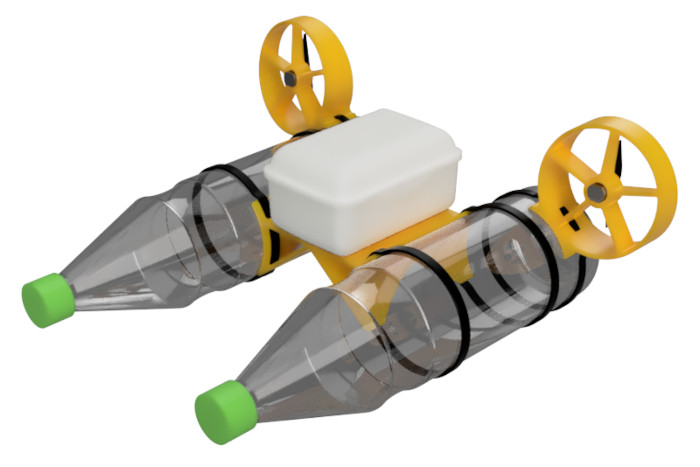
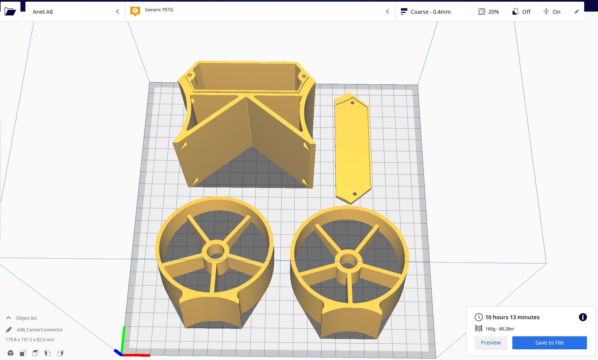
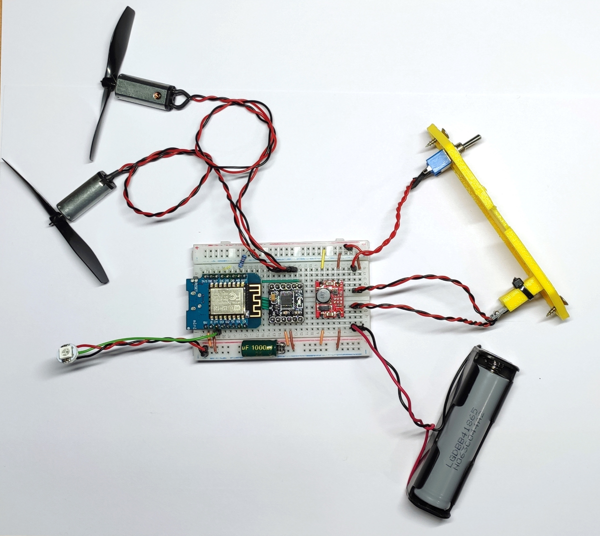
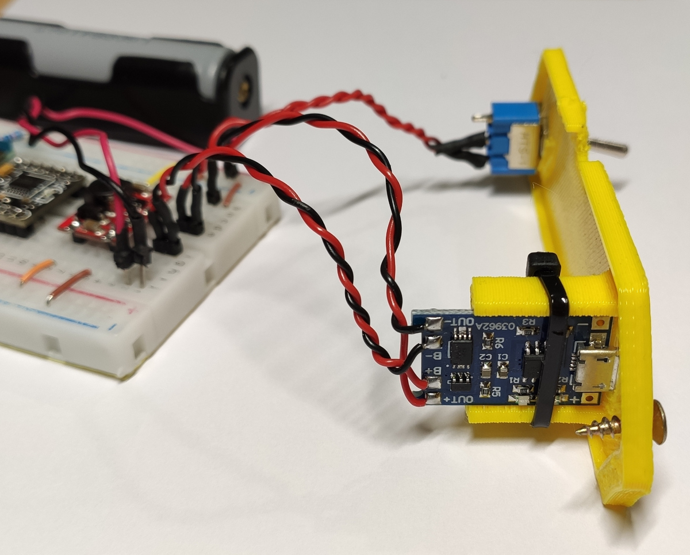
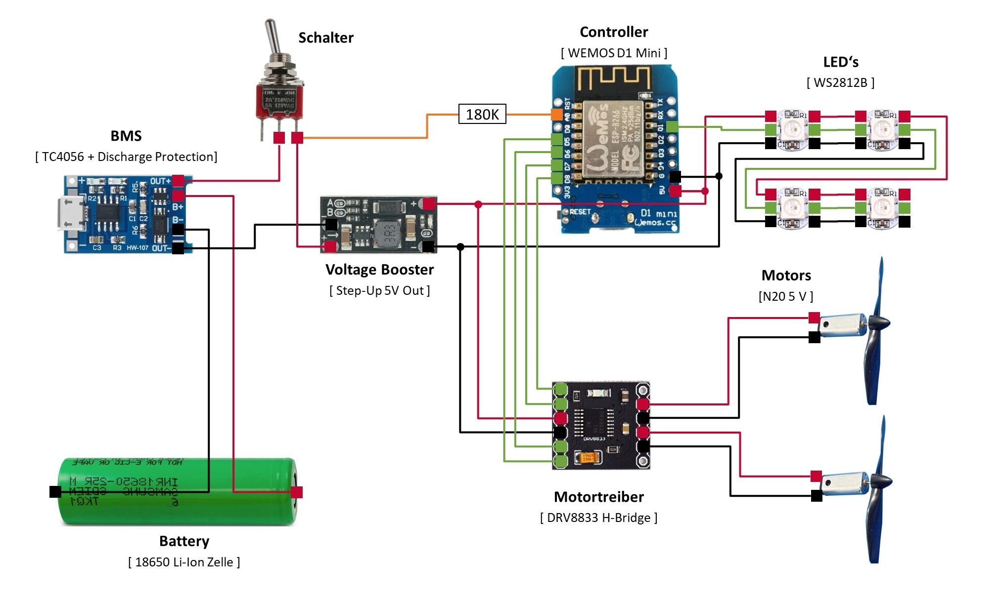

# MiniKenterprise
The Mini Kenterprise is a fun little project for anyone who wants to take a dive into the world of Arduino and electronics.
It is based on the "big" Kenterprise. A Project of mine that you can see over on [Instructables](https://www.instructables.com/Building-a-Self-Driving-Boat-ArduPilot-Rover/).
It is currently a WORK IN PROGRESS. Once it is finished it will look something like this:

## Bill of Materials
Electronics to buy:
| Position | Component | Description | Quantity | Link |
|----------|-----------|-------------|----------|------|
| 1 | Breadboard | 400 dots | 1x | [Aliexpress](https://de.aliexpress.com/item/32711841420.html?spm=a2g0o.productlist.0.0.69aa381393BqnZ&algo_pvid=5b0b763c-7e39-470d-ad8d-dc896d8a2570&algo_exp_id=5b0b763c-7e39-470d-ad8d-dc896d8a2570-1&pdp_ext_f=%7B%22sku_id%22%3A%2260928567388%22%7D), [AZ-Delivery](https://www.az-delivery.de/products/mini-breadboard?_pos=1&_sid=12607a080&_ss=r) |
| 2 | Jumper Wires | stiff | 1x | [Aliexpress](https://de.aliexpress.com/item/1005002828254543.html?spm=a2g0o.productlist.0.0.273e66efIJdZJB&algo_pvid=34572367-adc8-4615-9ad0-2bd02f056100&aem_p4p_detail=20211021042446286150965408330007926505&algo_exp_id=34572367-adc8-4615-9ad0-2bd02f056100-54&pdp_ext_f=%7B%22sku_id%22%3A%2212000022367973906%22%7D), [reichelt](https://www.reichelt.de/steckbruecken-drahtbruecken-set-140-teilig-steckboard-dbs-p79056.html?&trstct=pos_1&nbc=1) |
| 3 | Pins |Male Pin Headers | 20x | [Aliexpress](https://de.aliexpress.com/item/32993182990.html?spm=a2g0o.productlist.0.0.45532ff4sSm6qG&algo_pvid=c676763d-3223-4d05-9876-854d71d37ee1&algo_exp_id=c676763d-3223-4d05-9876-854d71d37ee1-0&pdp_ext_f=%7B%22sku_id%22%3A%2266952136433%22%7D), [Kein Link]() |
| 4 | Battery | 18650 Li-Ion Cell | 1x | [AliExpress](https://de.aliexpress.com/item/1005003394481523.html?spm=a2g0o.productlist.0.0.2f2a17e9Wt8ZAj&algo_pvid=c32a842c-d0d7-45cc-a587-c66c44ccf0d9&algo_exp_id=c32a842c-d0d7-45cc-a587-c66c44ccf0d9-2&pdp_ext_f=%7B%22sku_id%22%3A%2212000025582890802%22%7D), [reichelt](https://www.reichelt.de/industriezelle-18650-3-6-v-2850-mah-ungeschuetzt-1er-pack-sam-18650-29e-s-p278089.html?&trstct=pos_11&nbc=1) |
| 5 | Battery Holder | 18650 Holder | 1x | [AliExpress](https://de.aliexpress.com/item/1005001769305908.html?spm=a2g0o.productlist.0.0.3a27354agQ6Pio&algo_pvid=ca4395f5-f0e6-4309-a393-d1d4038c9448&algo_exp_id=ca4395f5-f0e6-4309-a393-d1d4038c9448-15&pdp_ext_f=%7B%22sku_id%22%3A%2212000024755845325%22%7D), [reichelt](https://www.reichelt.de/batteriehalter-fuer-1-18650-zelle-pin-halter-ha-1x18650-p141630.html?&trstct=pos_3&nbc=1) |
| 6 | BMS | TP4056 + Discharge Protection | 1x | [Aliexpress](https://de.aliexpress.com/item/4000522397541.html?spm=a2g0o.productlist.0.0.460e70f9hiyFH7&algo_pvid=164f3526-5845-419f-90b8-9293f51a1c33&algo_exp_id=164f3526-5845-419f-90b8-9293f51a1c33-3&pdp_ext_f=%7B%22sku_id%22%3A%2210000002700974720%22%7D), [reichelt](https://www.reichelt.de/entwicklerboards-ladeplatine-fuer-3-7v-li-akkus-micro-usb-1a-debo3-3-7li-1-0a-p291401.html?&trstct=pos_1&nbc=1)
| 7 | Switch | 2 Pin Toggle Switch | 1x | [Aliexpress](https://de.aliexpress.com/item/32919390284.html?spm=a2g0o.productlist.0.0.3bd64051ZGI1Yw&algo_pvid=4c30ae6c-6183-40d9-bef8-32658080ae47&algo_exp_id=4c30ae6c-6183-40d9-bef8-32658080ae47-0&pdp_ext_f=%7B%22sku_id%22%3A%2210000000938211422%22%7D) |
| 8 | Voltage Booster | 5V 3A Boost | 1x | [Aliexpress](https://de.aliexpress.com/item/1005002027119464.html?spm=a2g0o.productlist.0.0.81a7711bHeSAoy&algo_pvid=311379db-8755-4eef-8dd7-f3721bee5998&algo_exp_id=311379db-8755-4eef-8dd7-f3721bee5998-2&pdp_ext_f=%7B%22sku_id%22%3A%2212000018457419913%22%7D), [AZ-Delivery](https://www.az-delivery.de/products/mt3608-dc-dc-step-up-modul-1) |
| 9 | Capacitor | 470uF min 5V | 2x | [Aliexpress](https://de.aliexpress.com/item/32875701185.html?spm=a2g0o.productlist.0.0.1cbf7f5cbnNJI7&algo_pvid=b5abe3f7-8cf4-484c-a854-4b7f60c7e4c5&algo_exp_id=b5abe3f7-8cf4-484c-a854-4b7f60c7e4c5-3&pdp_ext_f=%7B%22sku_id%22%3A%2265570137243%22%7D), [reichelt](https://www.reichelt.de/elko-radial-470-uf-16-v-105-c-low-esr-fm-a-470u-16b-p200051.html?&trstct=pos_11&nbc=1) |
| 10 | Motor Driver | DRV8833 Dual H-Bridge | 1x | [Aliexpress](https://de.aliexpress.com/item/4000083406292.html?spm=a2g0o.productlist.0.0.1ceb2eb7kfWKHc&algo_pvid=acb5065d-311a-4a24-9c37-187b0974ba84&algo_exp_id=acb5065d-311a-4a24-9c37-187b0974ba84-0&pdp_ext_f=%7B%22sku_id%22%3A%2210000000221355749%22%7D), [*reichelt](https://www.reichelt.de/entwicklerboards-luefter-mit-propeller-modul-l9110-debo-fan-l9110-p282643.html?&trstct=pos_13&nbc=1) |
| 11 | Motor | M20 5V min DC Motor, 12mm diameter, 1mm shaft  | 2x | [Aliexpress](https://de.aliexpress.com/item/1005003199253570.html?spm=a2g0o.productlist.0.0.59025931P1d5qQ&algo_pvid=8513311f-bc9c-472d-8655-51d8797c7d1c&algo_exp_id=8513311f-bc9c-472d-8655-51d8797c7d1c-7&pdp_ext_f=%7B%22sku_id%22%3A%2212000024625599971%22%7D), [reichelt](https://www.reichelt.de/entwicklerboards-luefter-mit-propeller-modul-l9110-debo-fan-l9110-p282643.html?&trstct=pos_13&nbc=1)  |
| 12 | Peopeller | 1mm hole, 76mm diameter | 2x | [Aliexpress](https://de.aliexpress.com/item/1005003314629873.html?spm=a2g0o.productlist.0.0.56e46a65bcZ5sh&algo_pvid=80799301-ed8d-4227-9d88-257a5cae9411&algo_exp_id=80799301-ed8d-4227-9d88-257a5cae9411-12&pdp_ext_f=%7B%22sku_id%22%3A%2212000025168258281%22%7D), [*reichelt](https://www.reichelt.de/entwicklerboards-luefter-mit-propeller-modul-l9110-debo-fan-l9110-p282643.html?&trstct=pos_13&nbc=1) | 
| 13 | Microcontroller | Wemos D1 Mini | 1x | [Aliexpress](https://de.aliexpress.com/item/32831353752.html?spm=a2g0o.productlist.0.0.e76c5dcdMkkDG3&algo_pvid=a7b307b0-bce5-47fd-b257-1bd2229e5fea&algo_exp_id=a7b307b0-bce5-47fd-b257-1bd2229e5fea-0&pdp_ext_f=%7B%22sku_id%22%3A%2210000014440741148%22%7D), [AZ-Delivery](https://www.az-delivery.de/products/d1-mini) |
| 14 | RGB LED | Neopixel WS2812b | 1x | [Aliexpress](https://de.aliexpress.com/item/1005001908190390.html?spm=a2g0o.productlist.0.0.2a487705VLL9jw&algo_pvid=c4bda5cd-ed14-4bc9-b3c0-2085d5bf01b2&aem_p4p_detail=202110210452322979753173701440003605751&algo_exp_id=c4bda5cd-ed14-4bc9-b3c0-2085d5bf01b2-4&pdp_ext_f=%7B%22sku_id%22%3A%2212000018083134356%22%7D), [reichelt](https://www.reichelt.de/entwicklerboards-flora-rgb-smart-neopixel-4er-pack-ws2811-debo-np-f-rgb-p235471.html?&trstct=pos_6&nbc=1) |
| 15 | Resistor | 180 kOhm | 1x | [Aliexpress](https://de.aliexpress.com/item/1005002540879857.html?spm=a2g0o.productlist.0.0.56aa1046z7vc6n&algo_pvid=b86d9d5a-bcaf-418d-a984-3a94f9342a7c&algo_exp_id=b86d9d5a-bcaf-418d-a984-3a94f9342a7c-2&pdp_ext_f=%7B%22sku_id%22%3A%2212000021063599724%22%7D), [reichelt](https://www.reichelt.de/widerstand-metalloxyd-180-kohm-0207-1-0-w-5--1w-180k-p1791.html?&trstct=pos_3&nbc=1)|

Further Components..
| Position | Component | Description | Quantity | Link |
|----------|-----------|-------------|----------|------|
| 1 | Bottle | hard plastic 1l (eg. Coke, Sprite, ...) | 2x | |
| 2 | Centerpiece | 3D printed electronics enclosure | 1x | [STL File](3dFiles/Centerpiece_Body.stl) & [STL File](3dFiles/Centerpiece_Cap.stl)  |
| 3 | Fan Holder | 3D printed | 2x | [STL File](3dFiles/FanHolder.stl)|
| 4 | Ziptie | 200mm long, 4.3mm wide | 6x | |
| 5 | Screws | 2mm * 10mm | 2x | |

## Assembly
### 1. Start the Printer
Get the STL files (FanMount.stl and CenterEnclosure.stl) and open them in the slicing software of your choice. Cura is a good slicer for that. Set the layer height to 0.4 mm. You can go for 0.2 mm, which will look better, but it will also take a lot of time.
The parts where designed for 3D printing and don't need any support. The two fan mounts have to be printed with the backside laying on the printbed.

Start the slicing process and export the file to an SD card, a USB drive, whatever your 3D printer uses and start printing.

### 2. Put Wires on the external components
While the print is in progress you can prepare the motors the switch and the battery holder by adding wires and nice little pins to them. This is the trickiest 
### 3. Put Pins on everything
### 4. Assemble the breadboard

### 5. Program the Microcontroller
### 6. Prepare the 3D Printed Parts
### 7. Put everything together
### 8. Have fun

## Attachments
### Wiring Diagram
