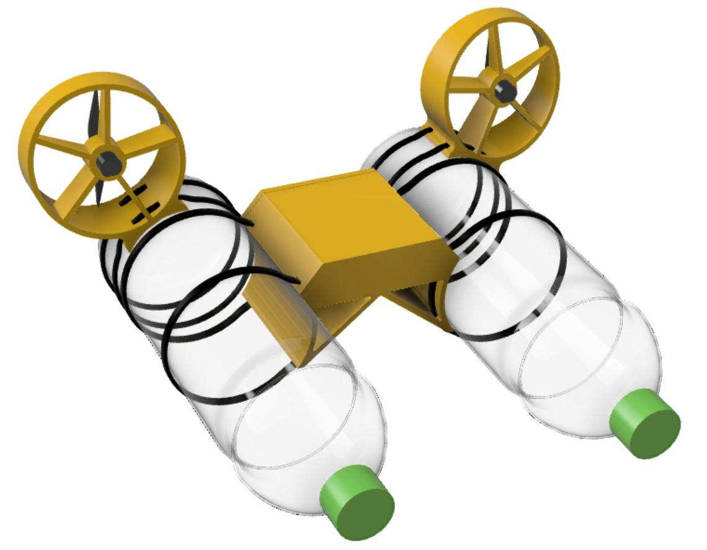

# MiniKenterprise
The Mini Kenterprise is a fun little project for anyone who wants to take a dive into the world of Arduino and electronics.

## Bill of Materials
Electronics to buy:
| Position | Component | Quantity | Link |
|----------|-----------|----------|------|
- 1x Breadboard
- 2x N50 Motor + 76mm Propeller
- 1x Wemos D1 Mini Development Board
- 2x DRV8833 H-Bridge/Motor Driver Module
- 1x 18650 Li-Ion Battery Cell
- 1x 18650 Holder
- 1x 5V Step Up/ Boost Converter
- 5x NeoPixel RGB LED

Parts to print:
- 2x Fan Holders
- 1x Center Connector

## Assembly
### 1. Start the Printer
Get the STL files (FanMount.stl and CenterEnclosure.stl) and open them in the slicing software of your choice. Cura is a good slicer for that. Set the layer height to 0.4 mm. You can go for 0.2 mm, which will look better, but it will also take a lot of time.
The parts where designed for 3D printing and don't need any support. The two fan mounts have to be printed with the backside laying on the printbed.

Start the slicing process and export the file to an SD card, a USB drive, whatever your 3D printer uses and start printing.

### 2. Put Wires on the external components
While the print is in progress you can prepare the motors the switch and the battery holder by adding wires and nice little pins to them. This is the trickiest 
### 3. Put Pins on everything
### 4. Assemble the breadboard
### 5. Program the Microcontroller
### 6. Prepare the 3D Printed Parts
### 7. Put everything together
### 8. Have fun

## Attachments
### Wiring Diagram
