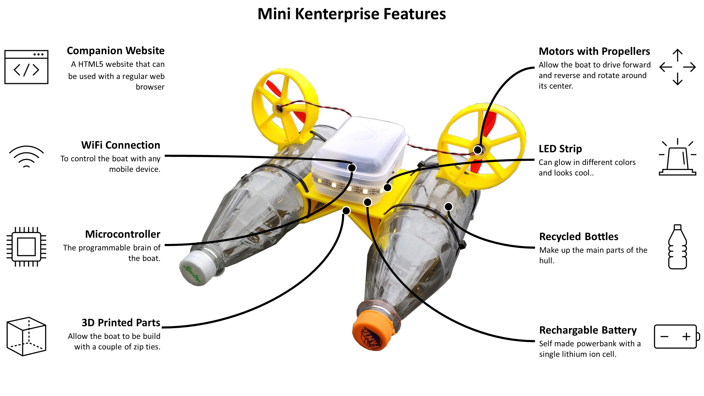
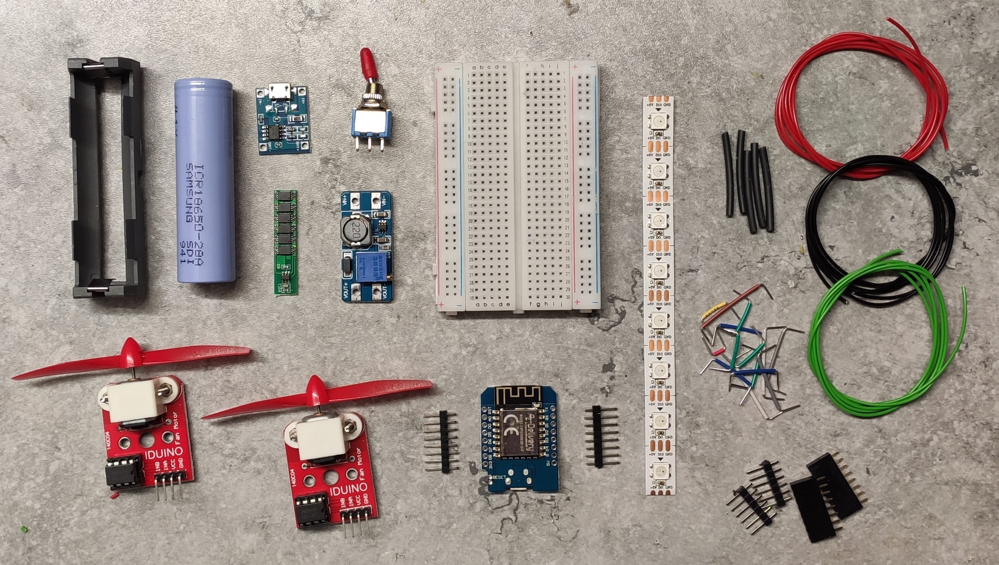
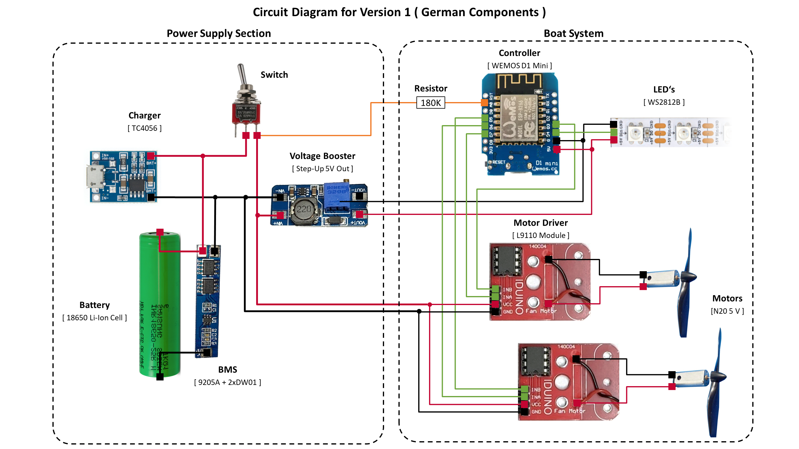
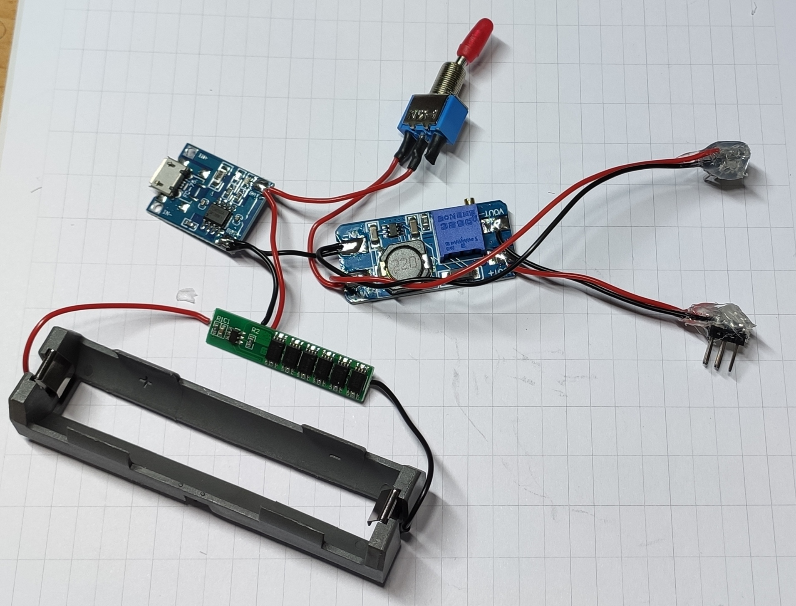
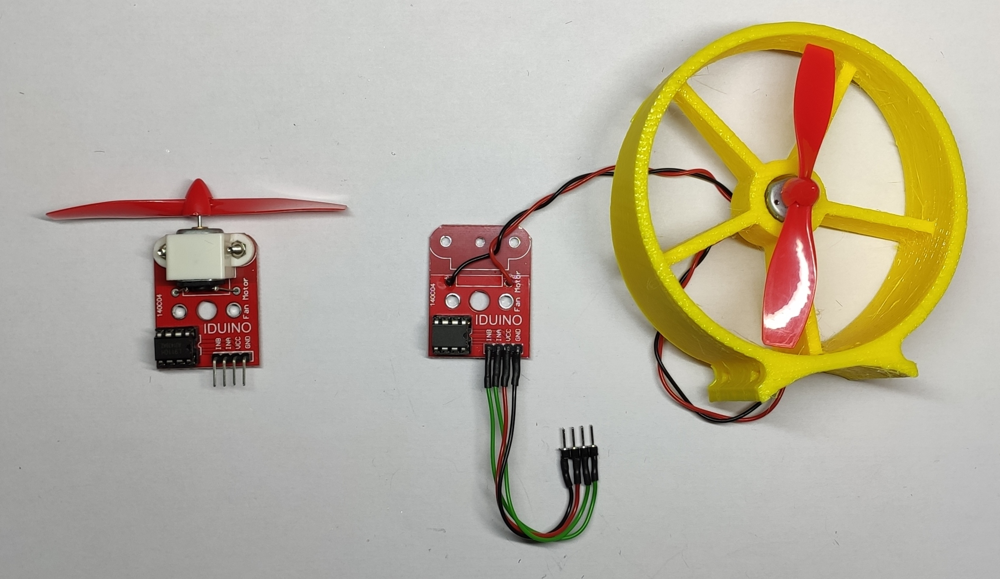
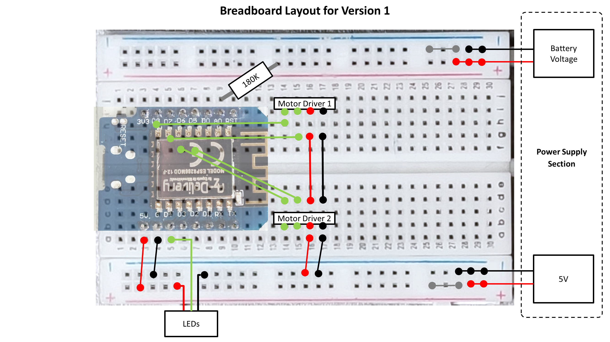
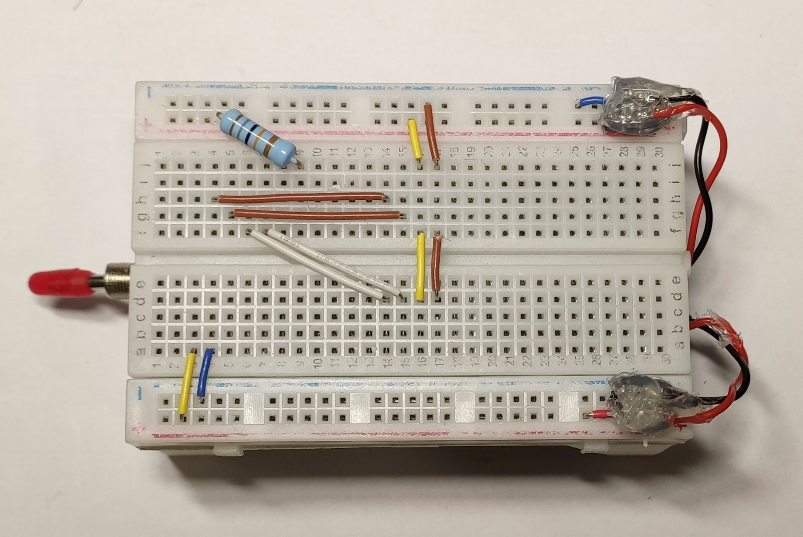
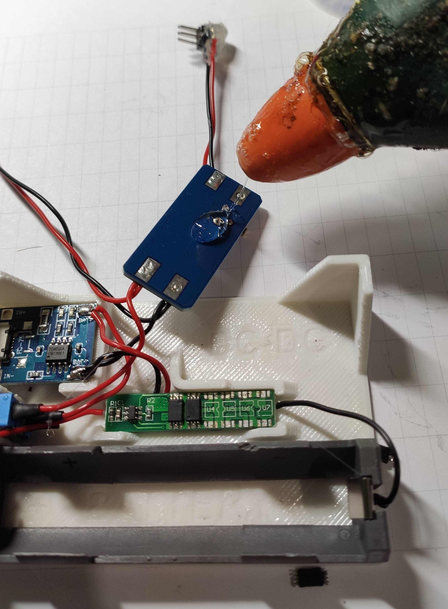
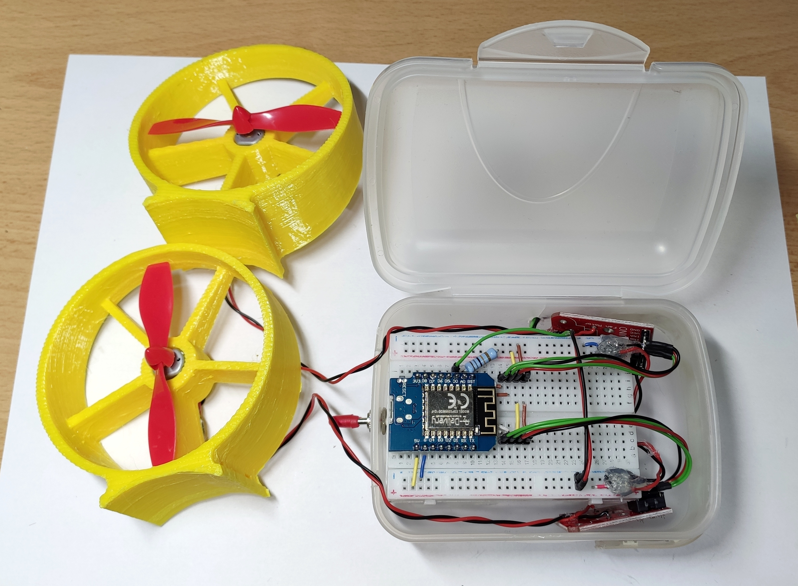
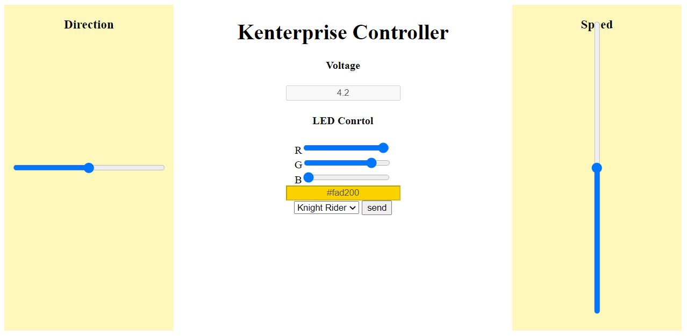

# !WORK IN PROGRESS!

# MiniKenterprise

## What is the Mini Kenterprise ?
The Mini Kenterprise started as a fun little weekend project and turned into a great little drone boat. Its purpose is to get people interested in tech science and ocean exploration. As such it is great for electronics enthusiasts like me but also for students in a workshop setting. 
The Mini Kenterprise, as its name might suggest, is a shrunk down version of a bigger boat. Its "big" sister is a self driving water surveying vessel that was built a couple of years ago and is documented on [Instructables](https://www.instructables.com/Building-a-Self-Driving-Boat-ArduPilot-Rover/).
While the Mini Kenterprise looks similar to it's big sister, it is way easier and also a lot chaeper to build. And it uses off-the-shelf components and fairly common tools.

## Why would you want to build one ?
Building a Mini Kenterprise touches on many different engineering disciplines, including 3D printing, soldering, programming and even wireless communication and web technologies.
All packaged in a little RC boat that uses two regular plastic bottles to stay afloat and can be controlled with a smartphone. 
What makes it stand out amongst other RC boats, is that you can build it yourself.
It offers a bunch of features, that can be seen in the graphic above.
It is an air boat, meaning that it moves by using two propellers. It also has a couple of LEDs that can do a cool knight rider effect.
[Here](https://user-images.githubusercontent.com/35432032/155309053-8130b957-cc9e-41b4-a569-48ad077a3d52.mp4) is a video of the first maiden voyage of my first working prototype.

## Updates
2026|07 Programming a Mini Kenterprise no longer requires the Arduino IDE - flash it straight from your browser at the [flashing website](https://basementengineering.github.io/MiniKenterprise/). WiFi credentials and pin assignments are now changed from the boat's own settings page instead of by editing code.
2024|09 Working on a new unified hardware architecture for student workshops according to my best practices so far.
2024|08 Working on a complete rewrite of the web frontend and a new installation method, that you can already get a taste of in my [duck project](https://www.instructables.com/How-to-Build-an-RC-Duck-With-Arduino-and-Wi-Fi/) with it's nice [duck flashing website](https://basementengineering.github.io/Duck/)

## How Do I Build One ?
Keep in mind that the Mini Kenterprise is not set in stone. It is not a simple of the shelf kit with instructions that tell you 100% exactly how you should build it.
I encourage anyone to build their very own version of the Kenterprise. 
However, especially for electronics beginners and also for student workshops it is great to have a little guide that you can follow along. 
That is why I developed and documented the Mini Kenterprise version 1. 

### 0. Get the materials
Below you can see a picture of the materials required to build a mini kenterprise.

The exact parts might change, depending on availability and i am trying to keep an updated document with the [bill of materials here](docs/materials/BOM.md). The cost of building a Mini Kenterprise in Germany are currently (2024) around 35€.

### 1. Find and prepare 2 bottles
The biggest componente of a Mini Kenterprise are the two plastic bottles that help it to stay afloat. It is important that the bottles have thick plastic walls. These make the boat more rigid. Thin bottles tend to heavily deform when they are closed off and the temperature changes.
I like to use coke or sprite bottles, as they have thick and straight walls. Most manufacturers tend to give their bottles all kinds of funky shapes. Unfortunateley those funky shapes make it hard to connect them to the 3D printed components.
The size of bottle that you want to use is up to you. 0.5 liter bottles make for a small and fast boat. 1L bootles make the boat slower, as they are pretty heavy, but the also make it more stable and allow for a payload (maybe a sensor) to be carried.
I found 0.75L bottles to be a great middle ground.
Make sure to remove the label, so it doesn't peel of in the water. You can do that by filling the bottle with warm water. This liquifies the adhesive.Also try to remove any water from the inside with a paper towel and a long spoon.  

### 2. Print the bridge and the fan enclosures
Apart from the bottles, there is a center piece called the bridege and two motor holders. These parts are made in a 3D printer. You can get the STL files under /3Dfiles.
Make sure to choose the right version for your motor and fan size 75mm(with 12mm motor) and your bottle size (0.5L or 0.75L). 

Open them in the slicing software of your choice. [Cura](https://ultimaker.com/de/software/ultimaker-cura) is a good slicer for that. 
It is best to print these parts out of PETG, as it is a very robust material, that doesn't deform on a hot summer day. Set the layer height to 0.4 mm. The parts where designed for 3D printing and don't need any support. The two fan mounts have to be printed with the flat side laying on the printbed.
Start the slicing process and export the file to an SD card, a USB drive, whatever your 3D printer uses and start printing.

### 3. Assemble the electronics
While the print is in progress you can prepare the interesting part of the boat (coming from an electrical engineer :D), the electronics.
The circuit diagram shows how all of the parts have to be connected.

#### 3.1 Assemble the power supply section
The "power supply section" or in other words our selfmade powerbank should be assembled first. Quick sidenote, you can also use an actual powerbank. The circuit diagram for this variant can be found under /images/version1/CircuitDiagramPowerbank.png. But if you decide to use an of the shelf powerbank, the microcontroller will not be able to read the current battery voltage. Therefore the companion website can not tell you how much battery you have left.
You can in theory put everything together on a breadboard.
Howerver, I would not reccomend this when it comes to power supply components, as the potential to plug something in the wrong way and fry your whole circuit or even start a battery fire is quite big.
Therefore all of the power supply components should be soldered togehter as seen in the following picture.

#### 3.2 Solder Wires and Pins to further Components
The rest of the components will be plugged into a breadboard, this makes it easy to change and expand your Mini Kenterprise in the future. Maybe you want to switch to different motors, or you want to add a sensor.
A breadboard makes that possible without having to pull out the soldering ion every time. However, you will have to add so called "header pins" to your components, to be able to comfortably plug them into the breadboard.

The best starting point for your soldering work are the modules, such as the microcontroller. Stick the pins into your breadboard and place the PCB (aka the board) on top.Then you can solder one pin at a time. Keep in mind to not heat anything up for too long (a few seconds not half a minute). The solder should flow nice and evenly and cover the metal rings on the board as well as your pins. A good soldering joint has an even surface.

The power supply connectors are probably the most important pins. These can be seen in the image below. I use three pins for each power rail. This way I inclrease the contact surface and make sure that it works, even if one pin is a little bit loose.
I also like to use a combination of 2 pins and 3 pins and block one hole in the breadboard, as shown in the picture. 
This way i instantly know ho to plug it in. When there is two power rails, with two connectors, i make sure to remove one pin on each side, so i can not accidentially switch them around.

Most components, such as switches come without wires, so you will have to solder wires to them with. Be sure to tin the wire and the surface you want to solder to first. 
To connect the two you then just have to hold them together and heat them up with the soldering ion before the tin connects them. Don't heat them up for too long, as the heat can melt the plastic bodies of the components.
Isolate each connection with some shrink tubing, hotglue or electrical tape.

Some modules don't really fit on the breadboard, or take up too much space. One of such modules is the motor module. You can modify it, by removing the motor from the board, and soldering long wires ( 25cm ) to it.

#### 3.3 Assemble the Breadboard
When you are done soldering, you can simply plug everything into the breadboard.

### 4. CHECK YOUR CONNECTIONS and hook everything up

### 5. Program the microcontroller
No Arduino IDE required. Go to the [Mini Kenterprise flashing website](https://basementengineering.github.io/MiniKenterprise/), plug your boat's microcontroller into your PC via USB, and click the install button (works in Chrome or Edge). That's it - the firmware, including the on-device Control UI, gets flashed straight from your browser.

If you're building "Version 1" from this guide, the default pins and WiFi settings already match your hardware, so there is nothing else to configure. If you built a different pin layout or want a different WiFi name/password, you can change those later from the boat's own settings page (see step 6) instead of editing any code.

If you'd rather build the firmware yourself (e.g. to modify it), the source lives under `/MiniKenterpriseCode`, the on-device Control UI source under `/minikenterprise_frontend`, and `deployFrontend.ps1` (repo root) rebuilds the Control UI and regenerates the headers the firmware embeds it from.

### 6. Put the boat into operation
After being turned on the boat acts as a WiFi Access Point that devices can connect to.
Take your phone and search for the WiFi Network. By default this is called `MiniKenterprise_1` (password `RowYourBoat`) - you can change both, along with the pin assignments, from the boat's settings page at any time.
After you are connected to the WiFi your phone is probably going to tell you that the network has no internet connection and reccomend to change networks.
Sometimes the phone even switches to another network or to mobile automatically. Make sure that you catch the popup message and tell your phone that it is ok to stay in this network.
Now you want to open a webbrowser and enter get to the controller website. This can be done by entering the IP address 1.2.3.4 into the browsers address field.
This will bring you to a little website that looks like this:

Time to confirm that the motors are working. Switch to mode 3 (buttons at the bottom).
Move the right stick all the way to the front. The right motor should start pushing air out the back. If the left motor starts spinning, you can simply switch the motor connectors around. If the motor pushes backwars, you can turn its connector around (switch + and  -).
Repeat the test for the left side.

### 7. Connect and charge the battery
Plug a Micro USB cable into the charging board. The LED should turn red, indicating that the battery is being charged. After 2 to 3 hours the LED will turn blue.

### 8. Use it
Now your boat is working properly and has a fully charged battery. Time to head to the lake.
Make sure that the weather is not too windy and not too rainy. It is also much more fun to play around in the sunshine.
Turn on your boat, connect your phone and take it for a spin on the water.
Try out the 4 different driving modes and figure out which one you like the most.
Keep an eye on the battery, if it consistently dips below 3.2V it is empty. If the voltage sinks too low, the BMS is going to disconnect the battery and leave your boat unmanouverable. Also make sure to stay in a range of about 20m and keep a long stick or a fishing line at hand, in case the boat gets stuck somewhere:D.

## How does it work? 
The Mini Kenterprise is a "smart" device that can "talk internet". It works as seen in the graphic below. It can host its own WiFi network (access point mode) or connect to an existing WiFi network (station mode). Through this WiFi network it can talk to a variety of other devices, such as the smartphone, that you might have in your pocket, or the laptop, that you might read this on.

Next to the WiFi connection the boat also has a little webserver, that can serve a companion website. This companion website is a little bit of code, that your phone can access and run, by talking to the server via HTTP. That might sound complicated, but it is simply a matter of opening a websbrowser and entering the boats IP address into the address field.
Once this website is on your phone, it opens a two-way-tunnel to the boats controller. This is called a websocket and it allows the website to send motor control commands to the boat and the boat to send back sensor data.
Thats basically it. The website also has a bunch of nice little buttons and text fields so the data doesn't look that bad. And it features two joysticks that allow you to take control of the boat using your touchscreeen.

## Project History
Before you can start a new DIY Project from Scratch, you will have to do a lot of planning. A lot of designing, building, testing and improving.
Luckyly for you, i already did that and went through a couple of prototypes.
So you will only have to read this if you are interested in the process.
I started with a 3D model, that I designed in Fusion 360. Below you can see a rendering of the latest version.

The circuit diagram was done in PowerPoint. A more professional way would be to draw the circuit diagram in an E-CAD tool such as KiCAD.
However I prefer powerpoint, as it is much easier to understand for Non-Electronics-Experts.

## Hardware Versions So Far
Every variant shares the same type of brain and the same code and user interface. What differs is the size, the motors and the energy source.

This little guide focusses on my "Version 1". This version was built especcially for a student workshop, with parts that can be purchased from german suppliers.

Here is a little overview of the other versions in the repository:

- Version 0 aka failure: Was a first test, did not really work out that well.
- Version 1 aka workshop version: Beginner friendly version that was developed with components from german suppliers.
- Version 2 aka small version: Smaller Version that uses 0.5l bottles and small props.
- Version 3 aka fast version: Medium sized version with big fans and 0.75l bottles. Optimized for low weight ans high power.

This guide focusses on version 1 but I have also built other versions that can also be found in this repository.

Here are the major technical differences in a table.
| Version Name 	| Motor | Motor Diameter | Fan Diameter | Bottle Size |
|---------------|---------------|---------------|---------------|---------------|
| Version 1	| Arduino 5V Motor Module 	| 12 mm | 75 mm | 1 L	|
| Version 2	| 3.7V Drone Motors 		| 7 mm 	| 45 mm | 0.5 L	|
| Version 2	| 3.7V Motors 			    | 12 mm | 75 mm | 0.75 L|

This repository contains images, circuit diagrams and material list for each version. These files and a dedicated little README can be found under images/versionX.

## Key Takeaways So Far
Motors consume a ton of power when starting up and microcontrollers don't like their voltage to dip. In my testing with bigger DC motors, they often didn't even manage to start or starting them took out the entire boat and reset the microcontroller. The reason is the insanely high current draw.
A solution is to either go with a battery that has a high C-rating (discharge rate) and an accompanying battery management system (BMS) that can handle the current. Or to use a low current motor.
In my experiments coreless dc motors proved to consume significantly less power and managed to start up with a small BMS-Board and didn't take the battery out. These motors can be found in cheap tiny drones at the toy store and they are way more fun, than regular dc motors. However, they don't like to be speed regulated, at least my Mini Kenterprise is having trouble going straight with it. Gluing a fin onto the hull, will probably be the easiest fix for that.