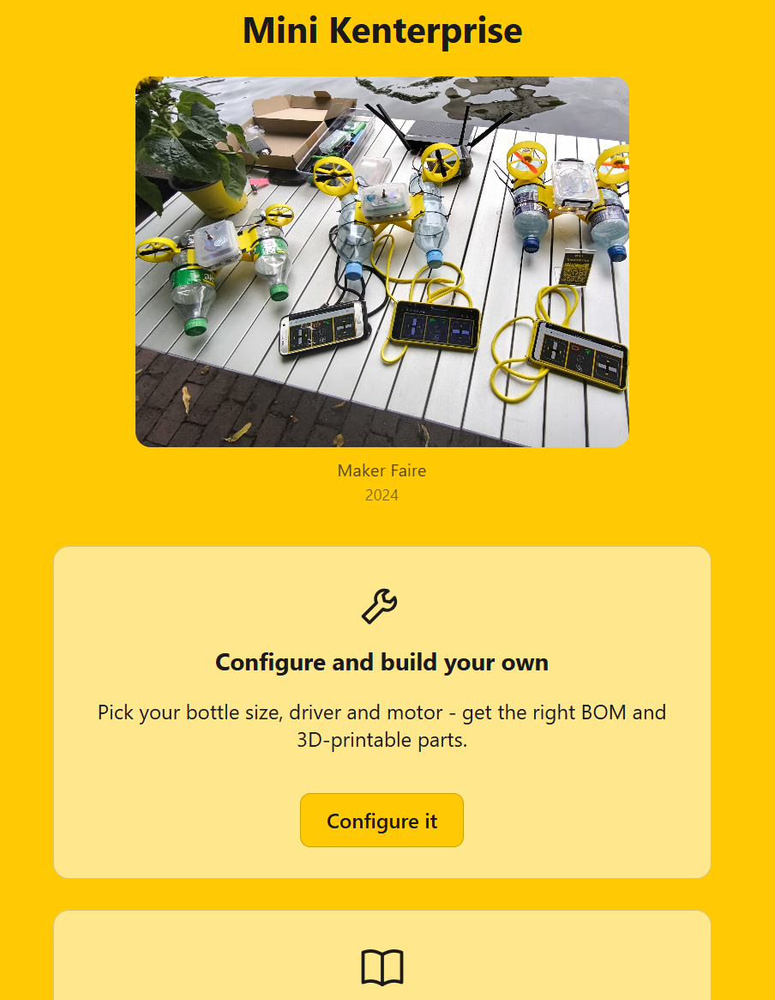
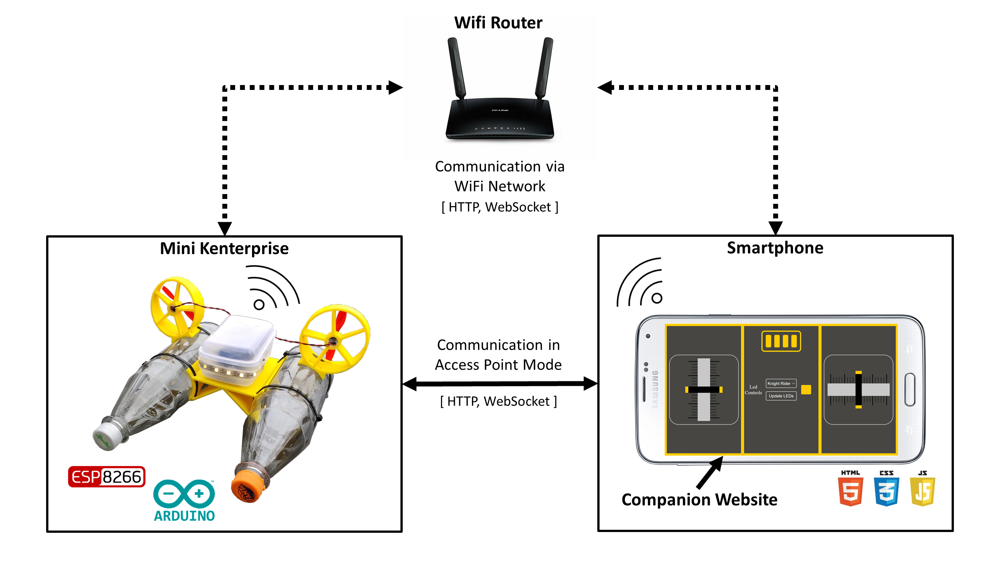
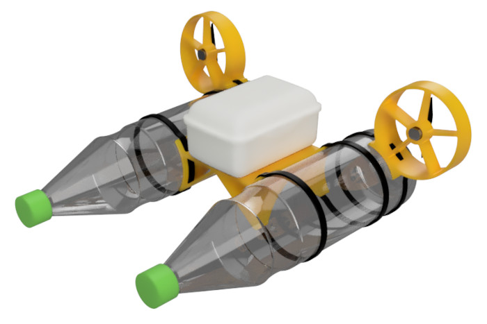

# MOSTY DONE BUT STILL IN PROGRESS

# MiniKenterprise

## What is the Mini Kenterprise ?
The Mini Kenterprise started as a fun little weekend project and turned into a great little drone boat. Its purpose is to get people interested in tech science and ocean exploration. As such it is great for electronics enthusiasts like me but also for students in a workshop setting. 
The Mini Kenterprise, as its name might suggest, is a shrunk down version of a bigger boat. Its "big" sister is a self driving water surveying vessel that was built a couple of years ago and is documented on [Instructables](https://www.instructables.com/Building-a-Self-Driving-Boat-ArduPilot-Rover/).
While the Mini Kenterprise looks similar to it's big sister, it is way easier and also a lot chaeper to build. And it uses off-the-shelf components and fairly common tools.

## Why would you want to build one ?
Building a Mini Kenterprise touches on many different engineering disciplines, including 3D printing, soldering, programming and even wireless communication and web technologies.
All packaged in a little RC boat that uses two regular plastic bottles to stay afloat and can be controlled with a smartphone. 
What makes it stand out amongst other RC boats, is that you can build it yourself.
It offers a bunch of features, that can be seen in the graphic above.
It is an air boat, meaning that it moves by using two propellers. It also has a couple of LEDs that can do a cool knight rider effect.
[Here](https://user-images.githubusercontent.com/35432032/155309053-8130b957-cc9e-41b4-a569-48ad077a3d52.mp4) is a video of the first maiden voyage of my first working prototype.

## Check out the new project website
Now most of the information on how to build your own mini kenterprise, including a dynamic bill of materials and a site to program and update it without the need for the Arduino IDE can be found [here](https://basementengineering.github.io/MiniKenterprise/).

## Updates
- 2026|07 Programming a Mini Kenterprise no longer requires the Arduino IDE - flash it straight from your browser at the [flashing website](https://basementengineering.github.io/MiniKenterprise/). WiFi credentials and pin assignments are now changed from the boat's own settings page instead of by editing code.
- 2024|09 Working on a new unified hardware architecture for student workshops according to my best practices so far.
- 2024|08 Working on a complete rewrite of the web frontend and a new installation method, that you can already get a taste of in my [duck project](https://www.instructables.com/How-to-Build-an-RC-Duck-With-Arduino-and-Wi-Fi/) with it's nice [duck flashing website](https://basementengineering.github.io/Duck/)

## How Do I Build One ?
Keep in mind that the Mini Kenterprise is not set in stone - it's not an off-the-shelf kit with instructions that tell you 100% exactly how to build it. That said, especially for electronics beginners and student workshops, it's great to have a guide to follow.

The full step-by-step build guide - materials, bottle prep, 3D printing, electronics assembly, soldering, testing, and first launch, all with photos - is on the [project site's Build Guide page](https://basementengineering.github.io/MiniKenterprise/build/) (source: [`docs/build/BuildGuide.md`](docs/build/BuildGuide.md)).

For everything else - the bill of materials, 3D-printable files for your chosen bottle/motor/prop combo, and flashing the firmware straight from your browser - head to the [project site](https://basementengineering.github.io/MiniKenterprise/).

## How does it work? 
The Mini Kenterprise is a "smart" device that can "talk internet". It works as seen in the graphic below. It can host its own WiFi network (access point mode) or connect to an existing WiFi network (station mode). Through this WiFi network it can talk to a variety of other devices, such as the smartphone, that you might have in your pocket, or the laptop, that you might read this on.

Next to the WiFi connection the boat also has a little webserver, that can serve a companion website. This companion website is a little bit of code, that your phone can access and run, by talking to the server via HTTP. That might sound complicated, but it is simply a matter of opening a websbrowser and entering the boats IP address into the address field.
Once this website is on your phone, it opens a two-way-tunnel to the boats controller. This is called a websocket and it allows the website to send motor control commands to the boat and the boat to send back sensor data.
Thats basically it. The website also has a bunch of nice little buttons and text fields so the data doesn't look that bad. And it features two joysticks that allow you to take control of the boat using your touchscreeen.

## Project History
Before you can start a new DIY Project from Scratch, you will have to do a lot of planning. A lot of designing, building, testing and improving.
Luckyly for you, i already did that and went through a couple of prototypes.
So you will only have to read this if you are interested in the process.
I started with a 3D model, that I designed in Fusion 360. Below you can see a rendering of the latest version.

The circuit diagram was done in PowerPoint. A more professional way would be to draw the circuit diagram in an E-CAD tool such as KiCAD.
However I prefer powerpoint, as it is much easier to understand for Non-Electronics-Experts.

## Hardware Versions So Far
Every variant shares the same type of brain and the same code and user interface. What differs is the size, the motors and the energy source.

This little guide focusses on my "Version 1". This version was built especially for a student workshop, with parts that can be purchased from german suppliers.

Here is a little overview of the other versions in the repository:

- Version 0 aka failure: Was a first test, did not really work out that well.
- Version 1 aka workshop version: Beginner friendly version that was developed with components from german suppliers.
- Version 2 aka small version: Smaller Version that uses 0.5l bottles and small props.
- Version 3 aka fast version: Medium sized version with big fans and 0.75l bottles. Optimized for low weight ans high power.

This guide focusses on version 1 but I have also built other versions that can also be found in this repository.

Here are the major technical differences in a table.
| Version Name 	| Motor | Motor Diameter | Fan Diameter | Bottle Size |
|---------------|---------------|---------------|---------------|---------------|
| Version 1	| Arduino 5V Motor Module 	| 12 mm | 75 mm | 1 L	|
| Version 2	| 3.7V Drone Motors 		| 7 mm 	| 45 mm | 0.5 L	|
| Version 2	| 3.7V Motors 			    | 12 mm | 75 mm | 0.75 L|

This repository contains images, circuit diagrams and material list for each version. These files and a dedicated little README can be found under [`docs/images/build/VersionX`](docs/images/build/).

## Key Takeaways So Far
Motors consume a ton of power when starting up and microcontrollers don't like their voltage to dip. In my testing with bigger DC motors, they often didn't even manage to start or starting them took out the entire boat and reset the microcontroller. The reason is the insanely high current draw.
A solution is to either go with a battery that has a high C-rating (discharge rate) and an accompanying battery management system (BMS) that can handle the current. Or to use a low current motor.
In my experiments coreless dc motors proved to consume significantly less power and managed to start up with a small BMS-Board and didn't take the battery out. These motors can be found in cheap tiny drones at the toy store and they are way more fun, than regular dc motors. However, they don't like to be speed regulated, at least my Mini Kenterprise is having trouble going straight with it. Gluing a fin onto the hull, will probably be the easiest fix for that.