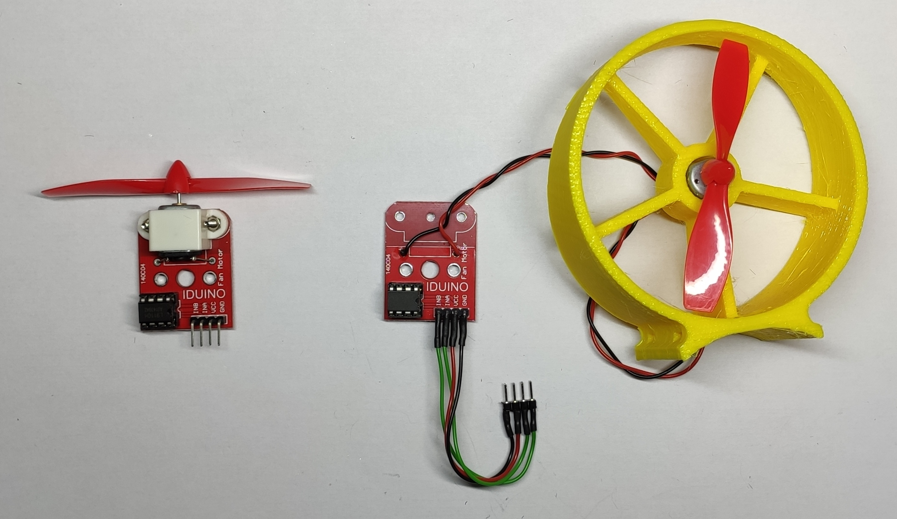

# !WORK IN PROGRESS!

# MiniKenterprise

## What is the Mini Kenterprise ?
The Mini Kenterprise started as a fun little weekend project. It can also be used for educational purposes, such as student workshops.
First and foremost it is a shrunk down version of my "big" Kenterprise. A self driving boat for water surveying that I documented on [Instructables](https://www.instructables.com/Building-a-Self-Driving-Boat-ArduPilot-Rover/).
While the Mini Kenterprise looks similar to it's big sister, its main goal is to get people interested in building their own drone boats.

Building a Mini Kenterprise touches all of the areas that are important in the construction of a big drone boat. We have 3D printing, soldering, programming and even wireless communication.
All packaged in a little RC boat that uses two regular plastic bottles to stay afloat and can be controlled with a smartphone. 
What makes it stand out amongst other RC boats, is that you can buld and program it yourself.
It offers a bunch of features, that can be seen in the graphic above. For example, the hull is made from simple plastic bottles, a couple of 3D printed parts and zipties.
It is an air boat, meaning that it moves by using two huge propellers. It also has a couple of LEDs that can do a cool knight rider effect.
[Here](https://user-images.githubusercontent.com/35432032/155309053-8130b957-cc9e-41b4-a569-48ad077a3d52.mp4) is a video of the first Maiden Voyage of my first working prototype.

## How Do I Build One ?
First things first, the Mini Kenterprise is not set in stone. It is not a simple of the shelf kit with instructions that tell you 100% exactly how you should build it.
I encourage anyone to build their very own version of the kenterprise. I have built suveral versions with different kinds of motors, different bottles and different electronic modules.
What they all share, is that they are little RC boats, that use a WiFi Microcontroller, so that they can be controlle with a smartphone.
This little guide mainly focusses on my "Version 1". This version was built especcially for a student workshop, with parts that can be purchased from german suppliers.

- Version 0 aka failure: Was a first test, did not really work out that well.
- Version 1 aka workshop version: Beginner friendly version that was developed with components from german suppliers.
- Version 2 aka small version: Smaller Version that uses 0.5l bottles and small props.
- Version 3 aka fast version: Medium sized version with big fans and 0.75l bottles. Optimized for low weight ans high power.

Here are the major technical differences in a table.
| Version Name 	| Motor | Motor Diameter | Fan Diameter | Bottle Size |
|---------------|---------------|---------------|---------------|---------------|
| Version 1	| Arduino 5V Motor Module 	| 12 mm | 75 mm | 1 L	|
| Version 2	| 3.7V Drone Motors 		| 7 mm 	| 45 mm | 0.5 L	|
| Version 2	| 3.7V Motors 			    | 12 mm | 75 mm | 0.75 L|

This repository contains images, circuit diagrams and material list for each version. These files and a dedicated little README can be found under images/versionX.
But remember that this is your built. You can mix and match versions, change components around and build your very own custom Mini Kenterprise.

### Bill of Materials
Electronics to buy:
| Position | Component | Description | Quantity | Link |
|----------|-----------|-------------|----------|------|
| 1 | Breadboard | 400 dots | 1x | [AZ-Delivery](https://www.az-delivery.de/products/mini-breadboard?_pos=1&_sid=12607a080&_ss=r) |
| 2 | Jumper Wires | stiff | 1x | [reichelt](https://www.reichelt.de/steckbruecken-drahtbruecken-set-140-teilig-steckboard-dbs-p79056.html?&trstct=pos_1&nbc=1) |
| 3 | Pins |Male Pin Headers | 20x | [Kein Link]() |
| 4 | Battery | 18650 Li-Ion Cell | 1x | [reichelt](https://www.reichelt.de/industriezelle-18650-3-6-v-2850-mah-ungeschuetzt-1er-pack-sam-18650-29e-s-p278089.html?&trstct=pos_11&nbc=1) |
| 5 | Battery Holder | 18650 Holder | 1x | [reichelt](https://www.reichelt.de/batteriehalter-fuer-1-18650-zelle-pin-halter-ha-1x18650-p141630.html?&trstct=pos_3&nbc=1) |
| 6 | Charger | TP4056 without protection | 1x | [reichelt](https://www.reichelt.de/entwicklerboards-ladeplatine-fuer-3-7v-li-akkus-micro-usb-1a-debo2-3-7li-1-0a-p291400.html?&trstct=pos_1&nbc=1)
| 7 | BMS | min. 3A Output | 1x | [Aliexpress](https://de.aliexpress.com/item/4001010955646.html?spm=a2g0o.productlist.0.0.20e822c8MUsP5C&algo_pvid=451857c9-a5b8-4a79-9d83-765ab7486e81&algo_exp_id=451857c9-a5b8-4a79-9d83-765ab7486e81-21&pdp_ext_f=%7B%22sku_id%22%3A%2210000013439349752%22%7D)
| 8 | Switch | 2 Pin Toggle Switch | 1x | |
| 9 | Voltage Booster | 5V 3A Boost | 1x | [AZ-Delivery](https://www.az-delivery.de/products/mt3608-dc-dc-step-up-modul-1) |
| 10 | Motor + Driver + Prop | DRV8833 Dual H-Bridge | 1x |  [reichelt](https://www.reichelt.de/entwicklerboards-luefter-mit-propeller-modul-l9110-debo-fan-l9110-p282643.html?&trstct=pos_13&nbc=1) |
| 11 | Microcontroller | Wemos D1 Mini | 1x | [Aliexpress](https://de.aliexpress.com/item/32831353752.html?spm=a2g0o.productlist.0.0.e76c5dcdMkkDG3&algo_pvid=a7b307b0-bce5-47fd-b257-1bd2229e5fea&algo_exp_id=a7b307b0-bce5-47fd-b257-1bd2229e5fea-0&pdp_ext_f=%7B%22sku_id%22%3A%2210000014440741148%22%7D), [AZ-Delivery](https://www.az-delivery.de/products/d1-mini) |
| 12 | RGB LED | Neopixel WS2812b strip (60LEDs/m) | 6 LEDs | [reichelt](https://www.reichelt.de/entwicklerboards-flora-rgb-smart-neopixel-4er-pack-ws2811-debo-np-f-rgb-p235471.html?&trstct=pos_6&nbc=1) |
| 13 | Resistor | 180 kOhm | 1x | [reichelt](https://www.reichelt.de/widerstand-metalloxyd-180-kohm-0207-1-0-w-5--1w-180k-p1791.html?&trstct=pos_3&nbc=1)|

Further Components..
| Position | Component | Description | Quantity | Link |
|----------|-----------|-------------|----------|------|
| 1 | Bottle | hard plastic 1l (eg. Coke, Sprite, ...) | 2x | |
| 2 | Centerpiece | 3D printed electronics enclosure | 1x |   |
| 3 | Fan Holder | 3D printed | 2x | |
| 4 | Mini Lunch Box | Plastic Container | 1x | |
| 5 | Ziptie | 200mm long, 4.3mm wide | 6x | |

### 1. Find and prepare 2 bottles
The biggest componente of a Mini Kenterprise are the two plastic bottles that help it to stay afloat. 
It is important that the bottles have thick plastic walls. These make the boat more rigid. 
Thin plastic bottles also tend to heavily deform when they are closed off and the temperature changes.
I like to use coke or sprite bottles, as they tend to have thick walls. 
Also try to find relatively straight bottles. Most manufacturers tend to give their bottles all kinds of funky shapes. 
Unfortunateley those funky shapes make it hard to connect them to the 3D printed components.
The size of bottle that you want to use is up to you. 0.5L bottles make for a small and fast boat. 1L bootles make the boat slower, as they are pretty heavy, but the also make it more stable and allow for a payload (maybe a sensor) to be carried.
I found 0.75L bottles to be a great middle ground.
Make sure to remove the label, so it doesn't peel of in the water. You can do that by filling the bottle with warm water. This liquifies the adhesive.
Also try to remove any water from the inside with a paper towel and a long spoon.  

### 2. Print the bridge and the fan enclosures
Get the STL files (FanMount.stl and CenterEnclosure.stl). Make sure to choose the right version for your motor and fan size (fans: 40mm (with 8mm motor) or 75mm(with 12mm motor) and your bottle size (0.5L or 0.75L). 
Open them in the slicing software of your choice. Cura is a good slicer for that. 
Set the layer height to 0.4 mm. You can go for 0.2 mm, which will looks better, but it will also take a lot more time.
The parts where designed for 3D printing and don't need any support. The two fan mounts have to be printed with the flat side laying on the printbed.
Start the slicing process and export the file to an SD card, a USB drive, whatever your 3D printer uses and start printing.

### 3. Assemble the electronics
While the print is in progress you can prepare the interesting part of the boat (coming from an electrical engineer :D), the electronics.
The circuit diagram shows how all of the parts have to be connected. Keep in mind that the circuit can differ, depending on the kinds of components you hava available.

#### 3.1 Assemble the power supply section
The "power supply section" or in other words our selfmade powerbank should be assembled first. Quick sidenote, you can also use an actual powerbank. The circuit diagram for this variant can be found under /images/version1/CircuitDiagramPowerbank.png. But if you decide to use an of the shelf powerbank, the control electronics wull not be able to check the current battery voltage.
You can in theory put everything together on a breadboard.
Howerver, I would not reccomend this when it comes to power supply components, as the potential to plug something in the wron way and fry your whole circuit or even start a battery fire is quite big.
Therefore all of the power supply components should be soldered.

#### 3.2 Solder Wires and Pins to further Components
The rest of the components will be connected to a breadboard, this makes it easy to change your Mini Kenterprise in the future. Maybe you want to switch to different motors, or you want to add a sensor.
A breadboard makes that possible without having to pull out the soldering ion every time. However, you will have to add so called "header pins" to your components, to be able to comfortably plug them into the breadboard.

The best starting point are the modules, such as the microcontroller. For this it is easiest to stick the pins into your breadboard and place the PCB (aka the board) on top.
Then you can solder one pin at a time. Keep in mind to not heat anything up for too long.

The power supply connectors are probably the most important pins. These can be seen in the image below. I use three pins for each power rail. This way I inclrease the contact surface and make sure that it works, even if one pin is a little bit loose.
I also like to use a combination of 2 pins and 3 pins and block one hole in the breadboard, as shown in the picture. 
This way i instantly know ho to plug it in. When there is two power rails, with two connectors, i make sure to remove one pin on each side, so i can not accidentially switch them around.

Most components, such as switches come without wires, so you will have to solder wires to them with. Be sure to tin the wire and the surface you want to solder to first. 
To connect the two you then just have to hold them together and heat them up with the soldering ion before the tin connects them. Don't heat them up for too long, as the heat can melt the plastic bodies of the components.
Isolate each connection with some shrink tubing, hotglue or electrical tape.

Some modules don't really fit on the breadboard, or take up too much space. One of such modules is the motor module. You can modify it, by removing the motor from the board, and soldering long wires ( 25cm ) to it.

#### 3.3 Assemble the Breadboard
When you are done soldering, you can simply plug everything into the breadboard.

### 4. CHECK YOUR CONNECTIONS and hook everything up

### 5. Program the microcontroller

### 6. Connect to the boat
After being turned on the boat acts as a WiFi Acess Point that devices can connect to.
Take your phone and search for the WiFi Network. The name and the password can be found in the config.h file under /MiniKenterprise/Code.
After you are connected to the WiFi your phone is probably going to tell you that the network has no internet connection and reccomend to change networks.
Sometimes the phone even switches to another network or to mobile automatically. Make sure that you catch the popup message and tell your phone that it is ok to stay in this network.
Now you want to open a webbrowser and enter get to the controller website. This can be done by entering the IP address 192.168.4.1 into the browsers address field.
This will bring you to a little website that looks like this:

Time to confirm that the motors are working. Switch to mode 3 (buttons at the bottom).
Move the right stick all the way to the front. The right motor should start pushing air out the back. If the left motor starts spinning, you can simply switch the motor connectors around. If the motor pushes backwars, you can turn its connector around (switch + and  -).
Repeat the test for the left side.

### 7. Connect and charge the battery
Plug a Micro USB cable into the charging board. The LED should turn red, indicating that the battery is being charged. After 2 to 3 hours the LED will turn blue.

### 8. Use it
Now your boat is working properly and has a fully charged battery. Time to head to the lake.
Make sure that the weather is not too windy and not too rainy. It is also much more fun to play around in the sunshine.
Turn on your boat, connect your phone and take it for a spin on the water.
Try out the 4 different driving modes and figure out which one you like the most.
Keep an eye on the battery, if it consistently dips below 3.2V it is empty. If the voltage sinks too low, the BMS is going to disconnect the battery and leave your boat unmanouverable. Also make sure to stay in a range of about 20m and keep a long stick or a fishing line at hand, in case the boat gets stuck somewhere:D.

## Sensor Attachments
There are no attachments yet

## Project History
Before you can start a new DIY Project from Scratch, you will have to do a lot of planning. A lot of designing, building, testing and improving.
Luckyly for you, i already did that and went through a couple of prototypes.
So you will only have to read this if you are interested in the process.
I started with a 3D model, that I designed in Fusion 360. Below you can see a rendering of the latest version.

The circuit diagram was done in PowerPoint. A more professional way would be to draw the circuit diagram in an E-CAD tool such as KiCAD.
However I prefer powerpoint, as it is much easier to understand for Non-Electronics-Experts.

