# Build Guide

This guide is being rewritten to follow the **Vorarlberg workshop setup** (0.5L bottle, DRV8833
driver, 720 motor, 55mm prop) - the current recommended starting point.

In the meantime:

- The [bill of materials](../materials/BOM.md) and the [Configurator](../configure.html) already
  cover the Vorarlberg setup and every other supported combination.
- Building the older 1L Wilhelmshaven setup instead (not reccommended)? See the
  [archived Wilhelmshaven build guide](./?guide=wilhelmshaven).

### 1. Get the electronics
Below you can see a picture of the electronics required to build a Mini Kenterprise.
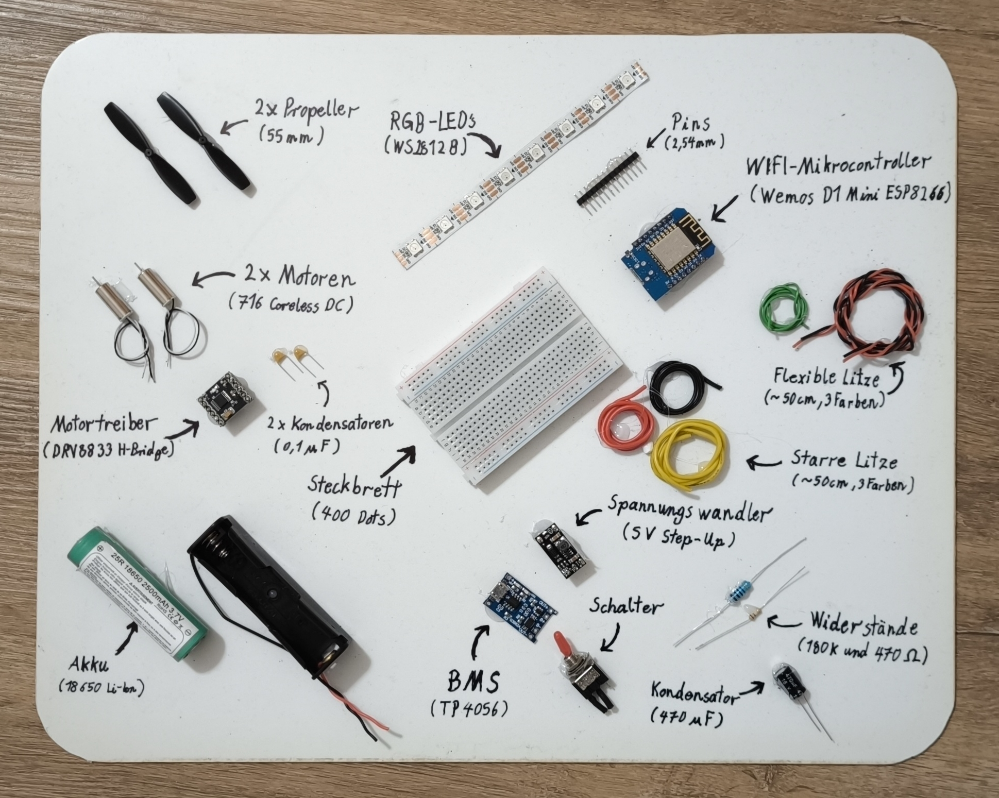
The exact parts might change, depending on availability and i am trying to keep an updated document with the bill of materials in the configurator. The cost of building a Mini Kenterprise in Germany are currently (2024) around 35€.
The configurator will also give you the correct 3D files to download for printing.

#### 1.1 Customizing( Optional )
Keep in mind that sometimes you might not be able to get exactly the right motor or exactly the right propeller. For these cases, I built the configurator and provided you with a bunch of different 3D file versions. Simply configure the build with your motor and prop and you will get an appropriate fan enclosure part.

### 2. Find and prepare 2 bottles
The biggest componente of a Mini Kenterprise are the two plastic bottles that help it to stay afloat. It is important that the bottles have thick plastic walls. These make the boat more rigid. Thin bottles tend to heavily deform when they are closed off and the temperature changes.
I like to use coke or sprite bottles, as they have thick and straight walls. Most manufacturers tend to give their bottles all kinds of funky shapes. Unfortunateley those funky shapes make it hard to connect them to the 3D printed components.
The size of bottle that you want to use is up to you. 0.5 liter bottles make for a small and fast boat. 1L bootles make the boat slower, as they are pretty heavy, but the also make it more stable and allow for a payload (maybe a sensor) to be carried.
I found 0.75L bottles to be a great middle ground.
Make sure to remove the label, so it doesn't peel of in the water. You can do that by filling the bottle with warm water. This liquifies the adhesive.Also try to remove any water from the inside with a paper towel and a long spoon.
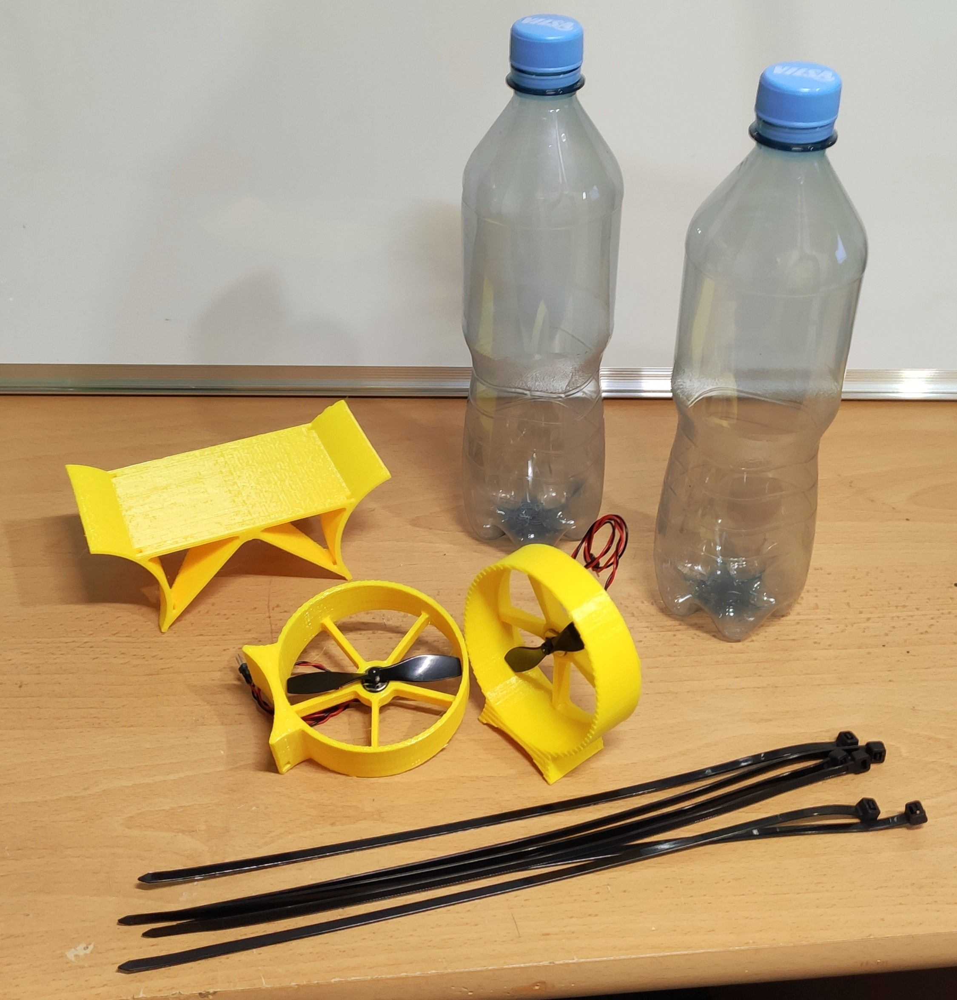

### 3. Print the bridge and the fan enclosures
Apart from the bottles, there is a center piece called the bridege and two motor holders. These parts are made in a 3D printer. You can get the STL files under [`/3dFiles`](../../3dFiles).
Make sure to choose the right version for your motor and fan size 75mm(with 12mm motor) and your bottle size (0.5L or 0.75L).

Open them in the slicing software of your choice. [Cura](https://ultimaker.com/de/software/ultimaker-cura) is a good slicer for that.
It is best to print these parts out of PETG, as it is a very robust material, that doesn't deform on a hot summer day. Set the layer height to 0.4 mm. The parts where designed for 3D printing and don't need any support. The two fan mounts have to be printed with the flat side laying on the printbed.
Start the slicing process and export the file to an SD card, a USB drive, whatever your 3D printer uses and start printing.

### 4. Assemble the electronics
While the print is in progress you can prepare the interesting part of the boat (coming from an electrical engineer :D), the electronics.
The circuit diagram shows how all of the parts have to be connected.
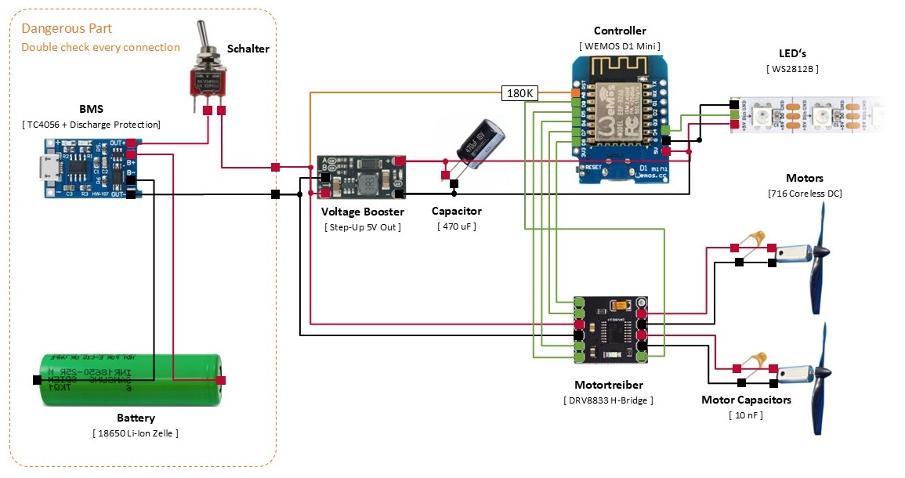.

#### 4.1 Assemble the power supply section
The "power supply section" or in other words our selfmade powerbank should be assembled first. 
You can in theory put everything together on a breadboard. Howerver, I would not reccomend this when it comes to power supply components, as the potential to plug something in the wrong way and fry your whole circuit or even start a battery fire is quite big. Therefore all of the power supply components should be soldered togehter as seen in the following picture. If you are not using a battery with a connector, but a battery holder, you would also have the holder on there.
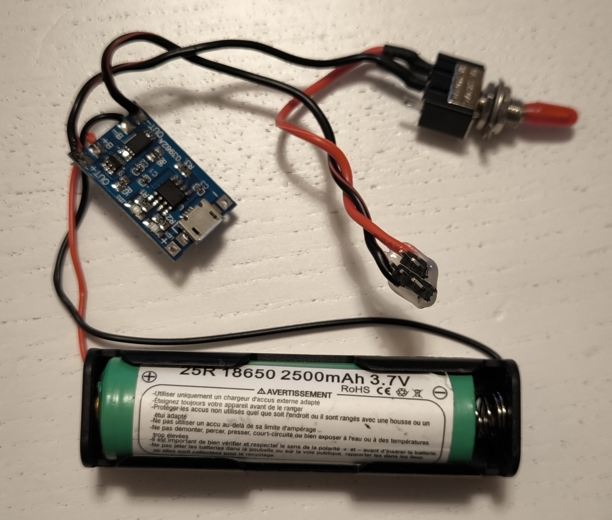
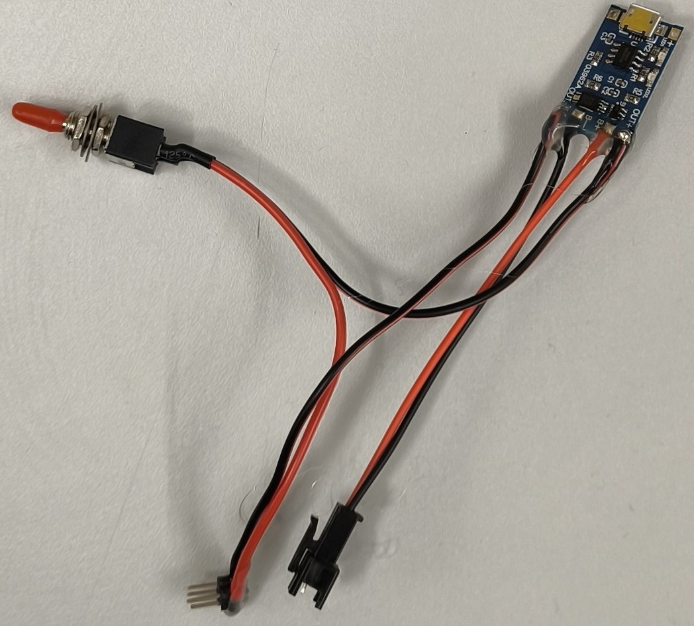
Quick sidenote, you can also use an actual powerbank. But if you decide to use an of the shelf powerbank, the microcontroller will not be able to read the current battery voltage. Therefore the companion website can not tell you how much battery you have left.

#### 4.2 Solder Wires and Pins to further Components
The rest of the components will be plugged plugged together. A breadboard makes that possible without having to pull out the soldering ion every time. However, you will have to add so called "header pins" to your components, to be able to comfortably plug them into the breadboard.
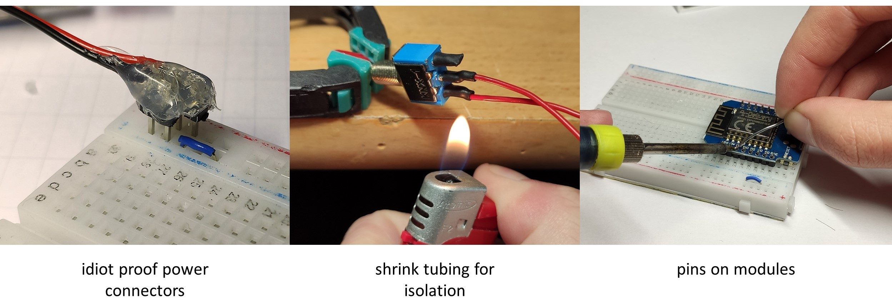
The best starting point for your soldering work are the modules, such as the microcontroller. Stick the pins into your breadboard and place the PCB (aka the board) on top.Then you can solder one pin at a time. Keep in mind to not heat anything up for too long (a few seconds not half a minute). The solder should flow nice and evenly and cover the metal rings on the board as well as your pins. A good soldering joint has an even surface.

The power supply connectors are probably the most important pins. These can be seen in the image below. I use three pins for each power rail. This way I inclrease the contact surface and make sure that it works, even if one pin is a little bit loose.
I also like to use a combination of 2 pins and 3 pins and block one hole in the breadboard, as shown in the picture.
This way i instantly know ho to plug it in. When there is two power rails, with two connectors, i make sure to remove one pin on each side, so i can not accidentially switch them around.

Most components, such as switches come without wires, so you will have to solder wires to them with. Be sure to tin the wire and the surface you want to solder to first.
To connect the two you then just have to hold them together and heat them up with the soldering ion before the tin connects them. Don't heat them up for too long, as the heat can melt the plastic bodies of the components.
Isolate each connection with some shrink tubing, hotglue or electrical tape.

#### 4.3 Assemble the Breadboard
When you are done soldering, you can simply plug everything into the breadboard.
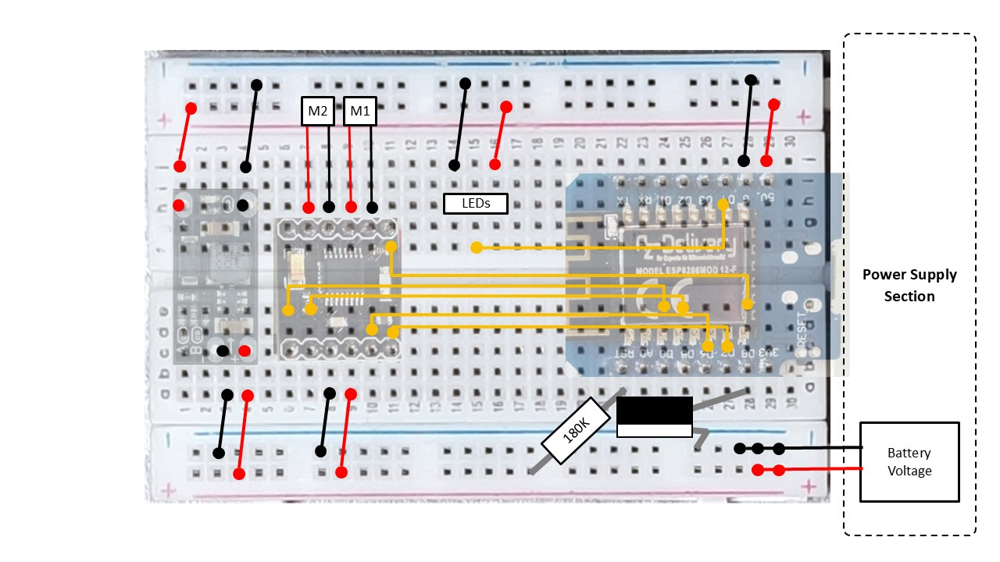
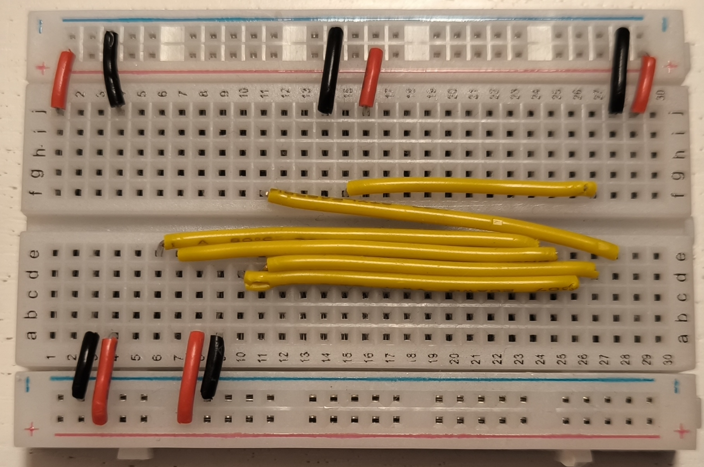
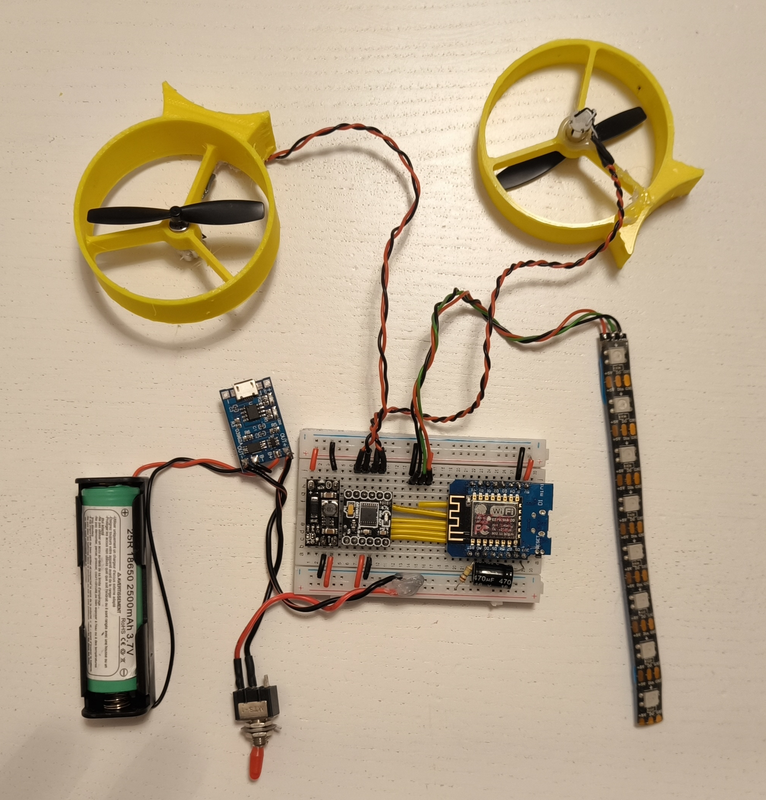

### 5. CHECK YOUR CONNECTIONS and hook everything up
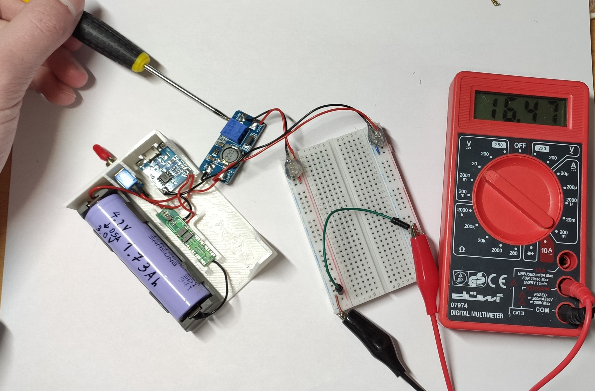

### 6. Program the microcontroller
No Arduino IDE required. Go to the [Mini Kenterprise flashing website](https://basementengineering.github.io/MiniKenterprise/), plug your boat's microcontroller into your PC via USB, and click the install button (works in Chrome or Edge). That's it - the firmware, including the on-device Control UI, gets flashed straight from your browser.

If you'd rather build the firmware yourself (e.g. to modify it), the source lives under [`/MiniKenterpriseCode`](../../MiniKenterpriseCode), the on-device Control UI source under [`/minikenterprise_frontend`](../../minikenterprise_frontend), and `deployFrontend.ps1` (repo root) rebuilds the Control UI and regenerates the headers the firmware embeds it from. See [`docs/DEVELOPMENT.md`](../DEVELOPMENT.md) for the full local development workflow (frontend dev server, testing, firmware upload, running the site locally).

### 7. Put the boat into operation
After being turned on the boat acts as a WiFi Access Point that devices can connect to.
Take your phone and search for the WiFi Network. By default this is called `MiniKenterprise_1` (password `RowYourBoat`) - you can change both, along with the pin assignments, from the boat's settings page at any time.
After you are connected to the WiFi your phone is probably going to tell you that the network has no internet connection and reccomend to change networks.
Sometimes the phone even switches to another network or to mobile automatically. Make sure that you catch the popup message and tell your phone that it is ok to stay in this network.
Now you want to open a webbrowser and enter get to the controller website. This can be done by entering the IP address 1.2.3.4 into the browsers address field.
This will bring you to a little website that looks like this:
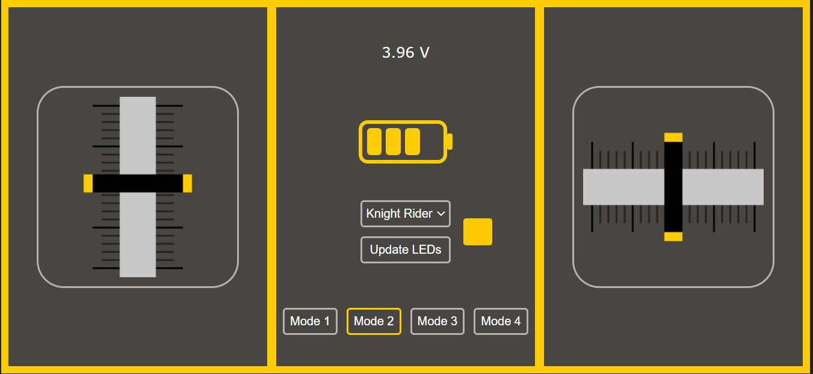

#### 7.1 Configure the software
If you're building the version from this guide and follow the wiring setup, and you don't need a custom boat wifi name or want to connect to an existing network, the default will match your needs and no setup is required. If you built a different pin layout or want a different WiFi name/password, you can change those later from the boat's own settings page (see step 6) instead of editing any code.

#### 7.2 Adjust the motors
Time to confirm that the motors are working. Switch to mode 3 (buttons at the bottom).
Move the right stick all the way to the front. The right motor should start pushing air out the back. If the left motor starts spinning, you can simply switch the motor connectors around. If the motor pushes backwars, you can turn its connector around (switch + and  -).
Repeat the test for the left side.

### 8. Connect and charge the battery
Plug a Micro USB cable into the charging board. The LED should turn red, indicating that the battery is being charged. After 2 to 3 hours the LED will turn blue.

### 9. Use it
Now your boat is working properly and has a fully charged battery. Time to head to the lake.
Make sure that the weather is not too windy and not too rainy. It is also much more fun to play around in the sunshine.
Turn on your boat, connect your phone and take it for a spin on the water.
Try out the 4 different driving modes and figure out which one you like the most.
Keep an eye on the battery, if it consistently dips below 3.2V it is empty. If the voltage sinks too low, the BMS is going to disconnect the battery and leave your boat unmanouverable. Also make sure to stay in a range of about 20m and keep a long stick or a fishing line at hand, in case the boat gets stuck somewhere:D.
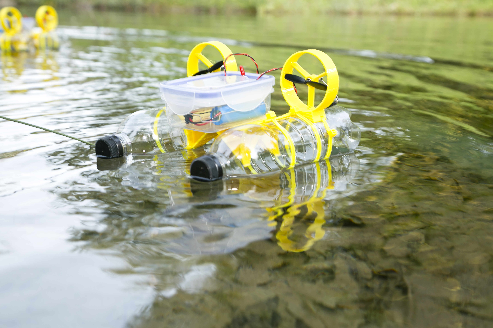