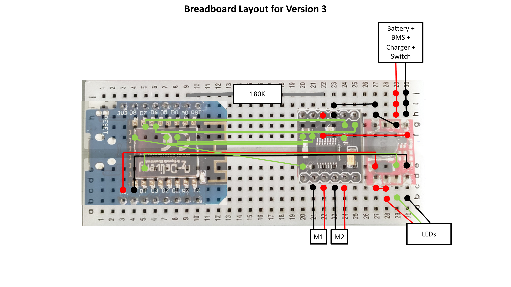

# Version 3
Optimised for speed with light 0.75l, strong 3.7V Motors, big fans and a very small electronics enclosure.
Suitable for intermediates.

### Bill of Materials
Electronics to buy:
| Position | Component | Description | Quantity | Link |
|----------|-----------|-------------|----------|------|
| 1 | Breadboard | 400 dots | 1x | [Aliexpress](https://de.aliexpress.com/item/32711841420.html?spm=a2g0o.productlist.0.0.69aa381393BqnZ&algo_pvid=5b0b763c-7e39-470d-ad8d-dc896d8a2570&algo_exp_id=5b0b763c-7e39-470d-ad8d-dc896d8a2570-1&pdp_ext_f=%7B%22sku_id%22%3A%2260928567388%22%7D) |
| 2 | Jumper Wires | stiff | 1x | [Aliexpress](https://de.aliexpress.com/item/1005002828254543.html?spm=a2g0o.productlist.0.0.273e66efIJdZJB&algo_pvid=34572367-adc8-4615-9ad0-2bd02f056100&aem_p4p_detail=20211021042446286150965408330007926505&algo_exp_id=34572367-adc8-4615-9ad0-2bd02f056100-54&pdp_ext_f=%7B%22sku_id%22%3A%2212000022367973906%22%7D), [reichelt](https://www.reichelt.de/steckbruecken-drahtbruecken-set-140-teilig-steckboard-dbs-p79056.html?&trstct=pos_1&nbc=1) |
| 3 | Pins |Male Pin Headers | 20x | [Aliexpress](https://de.aliexpress.com/item/32993182990.html?spm=a2g0o.productlist.0.0.45532ff4sSm6qG&algo_pvid=c676763d-3223-4d05-9876-854d71d37ee1&algo_exp_id=c676763d-3223-4d05-9876-854d71d37ee1-0&pdp_ext_f=%7B%22sku_id%22%3A%2266952136433%22%7D) |
| 4 | Battery | 18650 Li-Ion Cell | 1x | [AliExpress](https://de.aliexpress.com/item/1005003394481523.html?spm=a2g0o.productlist.0.0.2f2a17e9Wt8ZAj&algo_pvid=c32a842c-d0d7-45cc-a587-c66c44ccf0d9&algo_exp_id=c32a842c-d0d7-45cc-a587-c66c44ccf0d9-2&pdp_ext_f=%7B%22sku_id%22%3A%2212000025582890802%22%7D) |
| 5 | Battery Holder | 18650 Holder | 1x | [AliExpress](https://de.aliexpress.com/item/1005001769305908.html?spm=a2g0o.productlist.0.0.3a27354agQ6Pio&algo_pvid=ca4395f5-f0e6-4309-a393-d1d4038c9448&algo_exp_id=ca4395f5-f0e6-4309-a393-d1d4038c9448-15&pdp_ext_f=%7B%22sku_id%22%3A%2212000024755845325%22%7D) |
| 6 | Charger | TP4056 without protection | 1x | [Aliexpress](https://de.aliexpress.com/item/32467578996.html?spm=a2g0o.productlist.0.0.4dcf70f9WakeCp&algo_pvid=842f1695-cc25-4bc1-a38c-1cf906fc783d&aem_p4p_detail=202111230352556223191660969810000358539&algo_exp_id=842f1695-cc25-4bc1-a38c-1cf906fc783d-0&pdp_ext_f=%7B%22sku_id%22%3A%2210000003716909972%22%7D)
| 7 | BMS | min. 3A Output | 1x | [Aliexpress](https://de.aliexpress.com/item/4001010955646.html?spm=a2g0o.productlist.0.0.20e822c8MUsP5C&algo_pvid=451857c9-a5b8-4a79-9d83-765ab7486e81&algo_exp_id=451857c9-a5b8-4a79-9d83-765ab7486e81-21&pdp_ext_f=%7B%22sku_id%22%3A%2210000013439349752%22%7D)
| 8 | Switch | 2 Pin Toggle Switch | 1x | [Aliexpress](https://de.aliexpress.com/item/32919390284.html?spm=a2g0o.productlist.0.0.3bd64051ZGI1Yw&algo_pvid=4c30ae6c-6183-40d9-bef8-32658080ae47&algo_exp_id=4c30ae6c-6183-40d9-bef8-32658080ae47-0&pdp_ext_f=%7B%22sku_id%22%3A%2210000000938211422%22%7D) |
| 9 | Voltage Booster | 5V 3A Boost | 1x | [Aliexpress](https://de.aliexpress.com/item/32789971588.html?gatewayAdapt=glo2deu&spm=a2g0o.detail.0.0.60032feaxdTNxc&gps-id=pcDetailBottomMoreThisSeller&scm=1007.13339.169870.0&scm_id=1007.13339.169870.0&scm-url=1007.13339.169870.0&pvid=1cce7437-411f-4c78-8193-8489256c8459&_t=gps-id:pcDetailBottomMoreThisSeller,scm-url:1007.13339.169870.0,pvid:1cce7437-411f-4c78-8193-8489256c8459,tpp_buckets:668%232846%238112%231997&pdp_ext_f=%257B%2522sku_id%2522%253A%252263489306855%2522%252C%2522sceneId%2522%253A%25223339%2522%257D&pdp_pi=-1%253B1.06%253B-1%253B-1%2540salePrice%253BEUR%253Brecommend-recommend) |
| 11 | Motor Driver | DRV8833 Dual H-Bridge | 1x | [Aliexpress](https://de.aliexpress.com/item/4000083406292.html?spm=a2g0o.productlist.0.0.1ceb2eb7kfWKHc&algo_pvid=acb5065d-311a-4a24-9c37-187b0974ba84&algo_exp_id=acb5065d-311a-4a24-9c37-187b0974ba84-0&pdp_ext_f=%7B%22sku_id%22%3A%2210000000221355749%22%7D) |
| 12 | Motor | M20 3.7V min DC Motor, 12mm diameter, 1mm shaft  | 2x | [Aliexpress](https://de.aliexpress.com/item/4000440406820.html?gatewayAdapt=glo2deu&spm=a2g0o.order_list.0.0.21ef5c5fz7fggi) |
| 13 | Peopeller | 1mm hole, 76mm diameter | 2x | [Aliexpress](https://de.aliexpress.com/item/1005003314629873.html?spm=a2g0o.productlist.0.0.56e46a65bcZ5sh&algo_pvid=80799301-ed8d-4227-9d88-257a5cae9411&algo_exp_id=80799301-ed8d-4227-9d88-257a5cae9411-12&pdp_ext_f=%7B%22sku_id%22%3A%2212000025168258281%22%7D) | 
| 14 | Microcontroller | Wemos D1 Mini | 1x | [Aliexpress](https://de.aliexpress.com/item/32831353752.html?spm=a2g0o.productlist.0.0.e76c5dcdMkkDG3&algo_pvid=a7b307b0-bce5-47fd-b257-1bd2229e5fea&algo_exp_id=a7b307b0-bce5-47fd-b257-1bd2229e5fea-0&pdp_ext_f=%7B%22sku_id%22%3A%2210000014440741148%22%7D) |
| 15 | RGB LED | Neopixel WS2812b strip (60LEDs/m) | 6x | [Aliexpress](https://de.aliexpress.com/item/4000148759042.html?spm=a2g0o.productlist.0.0.b8c26097BDVBNI&algo_pvid=2af75e62-db7f-46df-84b4-273371ba9cf5&aem_p4p_detail=2021112303561715801964981300740000365539&algo_exp_id=2af75e62-db7f-46df-84b4-273371ba9cf5-4&pdp_ext_f=%7B%22sku_id%22%3A%2212000021774801945%22%7D) |
| 16 | Resistor | 180 kOhm | 1x | [Aliexpress](https://de.aliexpress.com/item/1005002540879857.html?spm=a2g0o.productlist.0.0.56aa1046z7vc6n&algo_pvid=b86d9d5a-bcaf-418d-a984-3a94f9342a7c&algo_exp_id=b86d9d5a-bcaf-418d-a984-3a94f9342a7c-2&pdp_ext_f=%7B%22sku_id%22%3A%2212000021063599724%22%7D) |

Further Components..
| Position | Component | Description | Quantity | Link |
|----------|-----------|-------------|----------|------|
| 1 | Bottle | hard plastic 1l (eg. Coke, Sprite, ...) | 2x | |
| 2 | Centerpiece | 3D printed electronics enclosure | 1x |   |
| 3 | Fan Holder | 3D printed | 2x | |
| 4 | Mini Lunch Box | Plastic Container | 1x | |
| 5 | Ziptie | 200mm long, 4.3mm wide | 6x | |

### Electronics Box
The schematic can be seen in the following image. It doesn't seem very different from the other versions. There is only minor changes.
The motors are directly connected to the battery voltage and a couple of the input pins for the motor driver are switched around.

Physically this circuit diagram is translated into a very cramed little electronics boy that can be seen here.
The Electronics Box is particularly small with this version and the battery is located next to the breadboard.
Due to this the power rails of the breadboard have to be removed and the corners of it have to be filed down.
A 3D-printed electronics adapter is used to hold the BMS board in place and route the wires.
The charger and the switch are attached to the top of the enclosure.
As there are no power rails and the space is limited, there is a lot of breadboard connections.
Almost all of them follow along the center line of the breadboard in order to keep the sides free for the external connectors.

